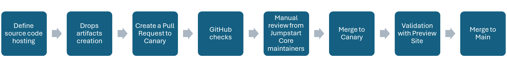
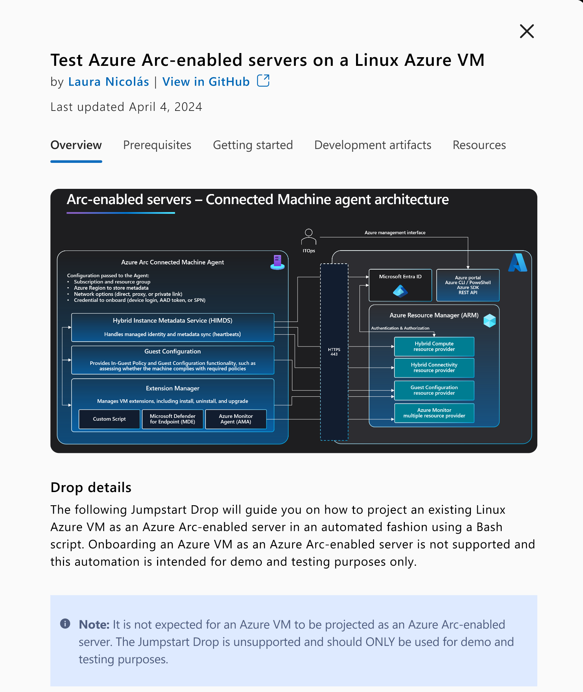

# Contribution Process

This project welcomes contributions and suggestions through GitHub, following the Azure Arc Jumpstart [Contribution Guidelines](https://arcjumpstart.com/contribution_guidelines). 

## Overview

Our goal is to create a simplified contribution process for our users that guarantees high quality standards for all submissions. Contributors can create submissions using GitHub directly, or leverage Jumpstart Drops page [Submit Drop](./) form to expedite the process. 

The contribution process consists of the following steps:

1. **Define source code hosting** : There are two alternatives to host the source code:

    - **Include Code in PR:** Include the code in the PR and host it as part of the [Arc Jumpstart Drops repository](https://github.com/Azure/arc_jumpstart_drops).
    - **Reference Author's Repository:** Keep the code in the author's repository and provide a reference URL in the Drop definition file (check [Drops schema](./SCHEMA.md)). Ensure that the repository is publicly available.

        | ℹ️ **Important**                          | 
        |------------------------------------------|
        | All Drops must be submitted under an MIT License. For more information, see [Licensing](./LICENSE).  |

1. **Drops artifacts creation**: Develop and validate the source code of the Drop and the JSON definition file. Ensure to test end to end, and provide clear documentation. The required artifacts include:

    - **Source Code**: Include the script/app/dashboard you've created, along with any necessary documentation (README, images, videos, etc.). Ensure these files follow the correct structure defined in the [folder structure](#folder-structure) section. 

    - **Drop Definition**: Provide a JSON file with all the required fields as described in the [Drops Schema](./SCHEMA.md) definition. This file will be used by the Arc Jumpstart Drops page to create a Drop card with all the necessary information, as well as apply the correct filtering mechanisms.  

        | ℹ️ **Important**                          | 
        |------------------------------------------|
        | The Drop definition JSON file should be placed under the [drops](./drops/) folder, and the name should be unique, descriptive and using snake_case.|

1. **Create Pull Request to Canary**: Submit your pull request (PR) to the Canary branch of [Arc Jumpstart Drops](https://github.com/Azure/arc_jumpstart_drops).

1. **GitHub Checks**: GitHub checks will run to ensure:
    - Drop definition and folder structure.
    - MIT licensing check
    - CodeQL for vulnerabilities.
    - Vale.sh Linter for documentation grammar and styling.

1. **Manual review from Jumpstart Core maintainers**: Automatic reviewers will be added. The PR can only be merged if all GitHub checks pass and at least 2 reviewers approved the submission.

1. **Merge to Canary**: If everything is correct, the PR will be merged to the **canary** branch, and the new Drop will be part of the approved Drops curated list. 

1. **Validation with Preview Site**: Validate the changes using the [Preview Azure Arc Jumpstart site](https://preview.arcjumpstart.com/arc_jumpstart_drops).

1. **Merge to Main**: Finally, once the **Canary** branch is merged to **Main** and publish to Production, the Drop will be available as part of [Azure Arc Jumpstart Drops](https://arcjumpstart.com/arc_jumpstart_drops).

## Drop Index

When you click on a Drop for more information, a right-side bar will appear with a more in-depth content of the Drop. The right bar leverages the **index.md** file of the Drop source code to render different tabs. To render the sections, the following headers (H3 or H4) are required to be part of the **index.md** file:

- **Overview**: This section provides a detailed description of the Drop, including important notes or other information that users must be aware of before running the Drop.

- **Prerequisites**: This section lists all the prerequisites that need to be configured before running the Drop. For each prerequisite, we encourage authors to be descriptive about the specific version (if needed) and provide the appropriate documentation links on how to configure it.

- **Getting Started**: This section provides detailed instructions on how to run the Drop. It includes a quick start approach and also covers the different configurations and parameters available. This section assumes that the prerequisites are already satisfied. If there's a way to run the Drop with one command, we recommend adding it and also explaining the different variables/parameters that could be used.

- **Resources**: This section lists resources that users can use for helpful information regarding the Drop and the products/prerequisites used.

- **Others**: This will render the content for all the other headers that aren't matching the above. 

    | ℹ️ **Important**                          | 
    |------------------------------------------|
    | While the sections described above are recommended for an optimal user experience, contributors are free to use their own layouts and sections. If no matching sections are found, all content will be rendered in a single tab labeled **Overview**.|

For example, if the **My First Example Drop** contains an **index.md** that contains the _Overview_, _Prerequisites_, _Getting started_ and _Resources_ sections, the right-bar will render as the following image:

## Folder structure

When submitting the Drop source code as part of the Pull Request into the Arc Jumpstart Drops repository, we encourage contributors to adhere to the following folder structure.

1. A root folder with the name of the Drop, using **snake_case** (for example, azure_arc_management_and_monitor_workbook)

1. Inside the root folder, a file name **_index.md** equivalent to a README file for the Drop. This file provides a brief introduction and overview of the Drop, its objectives, prerequisites, deployment steps, and any additional resources or references.

1. Inside the root folder, a new folder named **artifacts** that contains all the files and scripts that are needed to run the Drop.

1. Optionally, inside the artifacts folder, a new folder named **media** that contains any screenshots or architecture diagrams to showcase the Drop.