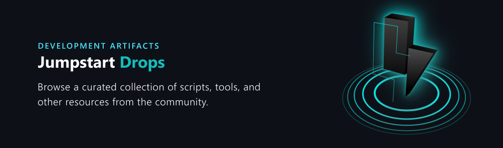

# Azure Arc Jumpstart Drops

Welcome to the Arc Jumpstart Drops repository! This repository is your go-to resource for all the source code and data for the Arc Jumpstart Drops collection. Whether you're a beginner discovering the curated Drops collection or an experienced user looking to submit a new, you'll find valuable insights tailored to your needs here.

<p align="center">
  
</p>

To get started, please carefully read our [Contributing guidelines](https://aka.ms/JumpstartDropsContribute). For any other question, check [Frequently Asked Questions (FAQ)](./FAQ.md) or submit an [Issue](./issues).

Please note that before contributing or using any Arc Jumpstart Drop, it's important to carefully review our [disclaimer](./DISCLAIMER.md). This will help you understand the risks and limitations associated with the use of all Drops.

## What you'll find here

- **Drops:** All the JSON [schema](./SCHEMA.md) files of the submitted Drops. Each file represents a Drop that's published in the Jumpstart Drops curated list. 
- **Drops Source Code:** Files and artifacts for Drops that opted to publish their source code to this repository.
- **Supportive Documents and Files:** Additional resources used across the [Arc Jumpstart Drops](https://arcjumpstart.com/azure_jumpstart_drops) website, aiding in various contexts and providing supplemental information.

## How to utilize this repository

Before you start, we recommend familiarizing yourself with our comprehensive [contribution guidelines](https://aka.ms/JumpstartContribution). These guidelines outline the standards and practices we follow, ensuring consistency and quality across our documentation.

If you're unsure about your future contribution, don't hesitate to start a [GitHub discussion](https://aka.ms/JumpstartDiscussions). This is a great place to ask questions, share ideas, or get feedback on potential contributions. Our community is here to help and we welcome all levels of experience.

Happy contributing!

## Branch guidance

The Arc Jumpstart Drops repository handles branching similarly to the other Arc Jumpstart [repositories](https://github.com/Azure/arc_jumpstart_docs). Two primary branches are maintained, each one attached to a specific website slot (prod/canary). 

The following branches are currently maintained:

| Branch                                                       | Website                    | Description                                                                                      |
| ------------------------------------------------------------ | -------------------------- | ------------------------------------------------------------------------------------------------ |
| [main](https://github.com/Azure/arc_jumpstart_drops/) (primary)               | https://arcjumpstart.com/azure_jumpstart_drops      | Latest Arc Jumpstart public website. This is the latest documentation and Drops available in the deployed to the production slot. |
| [canary](https://github.com/Azure/arc_jumpstart_drops/tree/canary) (preview) | https://preview.arcjumpstart.com/azure_jumpstart_drops | Pre-release documentation. Document and Drops updates should be merged to the canary branch for preview validation before merging to the main branch. |

## Cloning the repositories

To contribute, you'll likely need to clone this repository or use GitHub UI to create the Drops [schema.json](./SCHEMA.md). Use the following command to clone the repository:

```bash
git clone https://github.com/Azure/arc_jumpstart_drops
```

## Contribution and feedback

Your input and contributions are highly valued! If you have suggestions, feedback, or valuable insights to share, feel free to open an issue or create a new Drop submissions. 

This project welcomes contributions and suggestions. Most contributions require you to agree to a
Contributor License Agreement (CLA) declaring that you have the right to, and actually do, grant Arc Jumpstart team the rights to use your contribution. For details, visit [Microsoft CLA](https://cla.opensource.microsoft.com).

For more information about the Contribution process, see [Contributing](https://aka.ms/JumpstartDropsContribute) guidelines.

## Trademarks

This project may contain trademarks or logos for projects, products, or services. Authorized use of Microsoft trademarks or logos is subject to and must follow [Microsoft's Trademark & Brand Guidelines](https://www.microsoft.com/legal/intellectualproperty/trademarks/usage/general).

Use of Microsoft trademarks or logos in modified versions of this project must not cause confusion or imply Microsoft sponsorship.
Any use of third-party trademarks or logos are subject to those third-party's policies.
