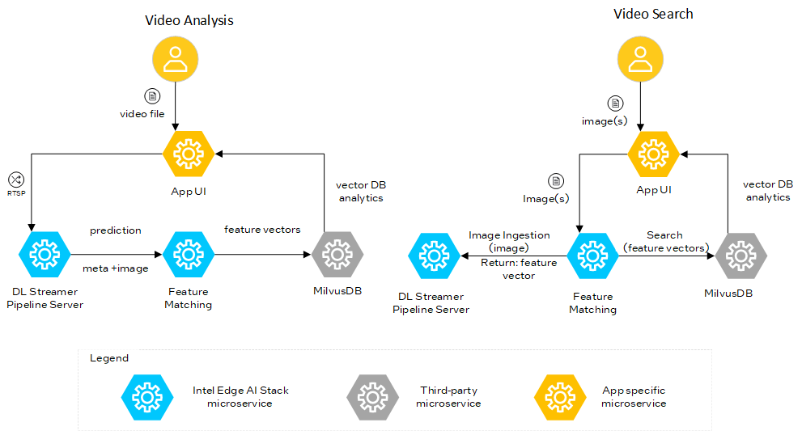

## Deploy Image-Based Video Search on an Azure Arc-enabled Kubernetes cluster

The following Azure arc drop will guide you how to deploy Image-Based Video Search (IBVS) sample application on Arc-enabled Kubernetes cluster.

The Image-Based Video Search sample application lets users search live or recorded camera feeds by providing an image and view matching objects with location, timestamp, and confidence score details.

This sample provides a working example of how to combine edge AI microservices for video ingestion, object detection, feature extraction, and vector-based search.

You can use this foundation to build solutions for diverse use cases, including city infrastructure monitoring and security applications, helping operators quickly locate objects of interest across large video datasets.

### How it Works
The application workflow has three stages: inputs, processing, and outputs.



*Diagram illustrating the components and interactions within the Image-Based Video Search system, including inputs, processing, and outputs.*

### Inputs
Video files or live camera streams (simulated or real time)
User-provided images or images captured from video for search
The application includes a demonstration video for testing. The video loops continuously and appears in the UI as soon as the application starts.

### Processing
- Video analysis with Deep Learning Streamer Pipeline Server and MediaMTX: Select Analyze Stream to start the DL Streamer Pipeline Server pipeline. The Pipeline Server processes video through MediaMTX, which simulates remote video cameras and publishes live streams. The Pipeline Server extracts frames and detects objects in each frame, publishing predictions through MQTT.

- Feature extraction with Feature Matching: DL Streamer Pipeline Server sends metadata and images through MQTT to the Feature Matching microservice. Feature Matching generates feature vectors. If predictions exceed the threshold, the system stores vector embeddings in MilvusDB and saves frames in the Docker file system.

- Storage and retrieval in MilvusDB: MilvusDB stores feature vectors. You can review them in MilvusUI.

- Video search with ImageIngestor: To search, first analyze the stream by selecting Analyze Stream. Then upload an image or capture an object from the video using Upload Image or Capture Frame. You can adjust the frame to capture a specific object. The system ingests images via ImageIngestor, processes them with DL Streamer Pipeline Server, and matches them against stored feature vectors in MilvusDB.

## Prerequisites

- Clone the Azure Arc Drops repository

    ```shell
    git clone https://github.com/Azure/arc_jumpstart_drops.git
    ```

- [Install Helm](https://helm.sh/docs/helm/helm_install/)

- Configure kubectl with authenticated access to your Azure Arc-enabled Kubernetes cluster. Ensure your kubeconfig context is set to the target cluster and you have sufficient permissions to deploy applications and create namespaces.

## Configuration

### Proxy Configuration Example

For environments requiring proxy configuration, create a values file or use inline parameters:

```yaml
# custom-values.yaml
httpProxy: "http://proxy.com:8080"
httpsProxy: "http://proxy.com:8080"
noProxy: "127.0.0.1"
```

## Getting Started

### Run deployment

Navigate to the [deployment folder](https://github.com/Azure/arc_jumpstart_drops/main/drops/sample_app/image_based_video_search/) and run:

**Basic deployment:**
```powershell
.\image_based_video_search_deploy.ps1
```

**Deployment with proxy configuration:**
```powershell
.\image_based_video_search_deploy.ps1 -SetValues @(
    "httpProxy=http://proxy.com:8080",
    "httpsProxy=http://proxy.com:8080",
    "noProxy=localhost\,127.0.0.1"
)
```

> **Note**: When using values that contain commas (like `noProxy`), you must escape them with backslashes (`\,`) to prevent Helm parsing errors.

**Deployment with custom values file:**
```powershell
.\image_based_video_search_deploy.ps1 -ValuesFile "custom-values.yaml"
```

**Available parameters:**
- `-ChartVersion`: Specify chart version (default: 1.0.1)
- `-Namespace`: Target namespace (default: ibvs)
- `-ReleaseName`: Helm release name (default: ibvs)
- `-SetValues`: Array of custom Helm values in "key=value" format
- `-ValuesFile`: Path to custom Helm values file
- `-DryRun`: Perform validation without actual deployment


### Verify the deployment

After the deployment completes, verify that all components are running correctly:

1. **Check the deployment status:**
   ```powershell
   helm status ibvs -n ibvs
   ```

2. **Verify all pods are running:**
   ```powershell
   kubectl get pods -n ibvs
   ```

3. **Access the application UI:**
   
   **Option 1: Port-forwarding (Recommended)**
   - Use port-forwarding to access the application locally:
     ```powershell
     kubectl port-forward svc/ibvs-app 3000:3000 -n ibvs
     ```
   - Open your web browser and navigate to `http://localhost:3000`
   - Press `Ctrl+C` to stop the port-forward when finished
   
   **Option 2: NodePort (Alternative)**
   - Get the NodePort service details:
     ```powershell
     kubectl get svc -n ibvs -o wide
     ```
   - Access the application using your cluster node IP and the assigned NodePort (e.g., `http://NODE_IP:NODE_PORT`)
   - Note: This requires the cluster nodes to be accessible from your network
   
   The application should display a video stream interface for testing image-based search functionality

4. **Monitor application logs (optional):**
   ```powershell
   kubectl logs -f deployment/<deployment-name> -n ibvs
   ```

The Image-Based Video Search application should now be accessible and ready for testing video analysis and object search capabilities.
