## Introduction

According to [LoRa Alliance](https://lora-alliance.org/), “LoRaWAN® is a Low Power, Wide Area (LPWA) networking protocol designed to wirelessly connect battery-operated ‘things’ to the internet in regional, national or global networks, and targets key Internet of Things (IoT) requirements such as bidirectional communication, end-to-end security, mobility and localization services.”
In simple terms, LoRaWAN® allows low-cost and low-power communication between devices and gateways within the range of physical buildings.
Advantages of LoRaWAN®:

- Ideal for single-building uses/applications
- Easy to set up and manage your personal network
- LoRa devices work without strain even when in motion
- Devices using LoRa tech have extended/long battery lives
- Supports bidirectionality such as command-and-control functionality

We are seeing an increasing number of devices using LoRaWAN® as their communication protocol. For systems based on LoRaWAN®, how can we integrate them with Azure IoT Operations? To address this question, we will implement a solution that takes data from LoRaWAN®-based systems and pushes it to Azure IoT Operations. This solution uses a custom broker that understands LoRaWAN® communication data and communicates with Azure IoT Operations via MQTT, using port forwarding through a broker listener.

## Architecture

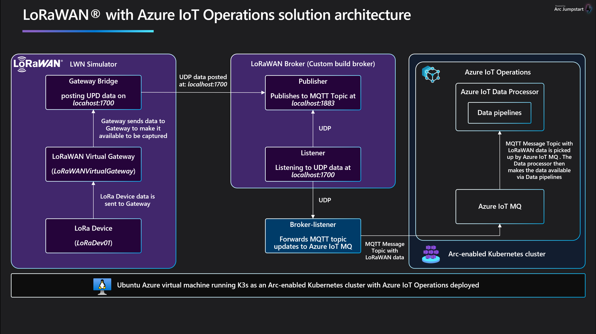

## Solution overview

A typical LoRaWAN® based architecture comprises of:

- LoRa Devices
- LoRaWAN® Gateway
- A network server (optional)

The LoRa device sends LoRaWAN messages/packets which the packet forwarder will decrypt and create a UDP packet. The UDP packet is then forwarded to a network server using a Gateway Bridge that is part of the LoRaWAN® Gateway. Typically, a network server would have applications registered that would process the incoming UDP data for upstream systems.

In our case we will be using [LWN Simulator](https://github.com/UniCT-ARSLab/LWN-Simulator) to simulate LoRa devices and LoRaWAN® Gateways. Instead of using network server, we will be implementing our own custom LoRaWAN® Broker that will receive UDP data from LoRaWAN® Gateway simulator as part of LWN Simulator using Gateway Bridge.

After receiving LoRaWAN® UDP data, the custom LoRaWAN® Broker, would forward data to Azure IoT Operations using MQTT broker. This is how the data from simulated LoRa device would make it to Azure IoT operations through simulated LoRaWAN® Gateway and custom LoRaWAN® Broker.

## Prerequisites

### VM that can run Azure IoT operations

For our example, we are going to be using Ubuntu VM to build the solution.

#### Required tools on VM

- Git

  ````bash
  sudo apt install git
  ````

- Download the drop's files
  - Download the content of this drop to your Ubuntu VM where you would be running Azure IoT Operations and other components.
  - Extract the contents of this drop into a folder. Here we are using LoRaWAN folder for reference.

- [Python 3.8 or above](https://www.python.org/)

- Paho MQTT Client Library

  - For LoRaWAN Broker, we will be leveraging Paho library to post messages to MQTT topic using the LoRaWAN Broker.
  - For details about the Paho library, please visit: <https://pypi.org/project/paho-mqtt/>

  - Install steps for Paho MQTT Library

    - Before running the following steps, please make sure you have installed Python in previous step.
    - Open a new terminal window and run the following commands.

        ```bash

        # Please make sure we have python3-pip installed. If not please run following command.
        sudo apt install python3-pip

        # To install Paho MQTT Client, run the following command.
        pip3 install paho-mqtt
        ```

## Solution Build Steps

### Step 1 - Building an Ubuntu VM running Azure IoT Operation

#### Prepare your Azure Arc-enabled Kubernetes cluster on Ubuntu

Complete the prerequisite steps for [Prepare your Azure Arc-enabled Kubernetes cluster](https://learn.microsoft.com/en-us/azure/iot-operations/deploy-iot-ops/howto-prepare-cluster?tabs=ubuntu).

**_NOTE:_** Using the above-mentioned documentation, we get the following scripts under "Ubuntu VM Install Steps" section. Please update your deployment scripts accordingly.

#### Ubuntu VM Install Steps

##### Install curl

```bash
sudo snap install curl
```

##### Install Azure CLI

```bash
curl -sL https://aka.ms/InstallAzureCLIDeb | sudo bash
```

##### Install azure-iot-ops extension

**_NOTE:_** As we will be using the data processor, we must deploy Azure IoT Operations v0.5.1 with the additional argument to specify the correct version. To do that we will be adding '--version 0.5.1b1' parameter to the following command.

```bash
az extension add --upgrade --name azure-iot-ops --version 0.5.1b1 
```

##### Create a cluster

###### Install K3s

```bash
curl -sfL https://get.k3s.io | sh -
```

###### Create a K3 configuration yaml

```bash
mkdir ~/.kube
sudo KUBECONFIG=~/.kube/config:/etc/rancher/k3s/k3s.yaml kubectl config view --flatten > ~/.kube/merged
mv ~/.kube/merged ~/.kube/config
chmod  0600 ~/.kube/config
export KUBECONFIG=~/.kube/config
```

###### Switch to k3s context

```bash
kubectl config use-context default
```

###### Run the following to increase the user watcher/instance limits

```bash
echo fs.inotify.max_user_instances=8192 | sudo tee -a /etc/sysctl.conf
echo fs.inotify.max_user_watches=524288 | sudo tee -a /etc/sysctl.conf

sudo sysctl -p
```

###### Increase the descriptor limits

```bash
echo fs.file-max = 100000 | sudo tee -a /etc/sysctl.conf

sudo sysctl -p
```

#### ARC enable the cluster

**_NOTE:_** As we will be using the data processor, we must deploy Azure IoT Operations v0.5.1 with the additional argument to specify the correct version. To do that we will be adding '--version 0.5.1b1' parameter to the following command.

```bash
az extension add --upgrade --name azure-iot-ops --version 0.5.1b1
sudo apt update && sudo apt upgrade
az login --tenant [Your_Tenant_Id]

# Id of the subscription where your resource group and Arc-enabled cluster will be created
export SUBSCRIPTION_ID=[Your_Subscription_Id]

# Azure region where the created resource group will be located
# Currently supported regions: "eastus", "eastus2", "westus", "westus2", "westus3", "westeurope", or "northeurope"
export LOCATION=eastus2

# Name of a new resource group to create which will hold the Arc-enabled cluster and Azure IoT Operations resources
export RESOURCE_GROUP="[Your_ResourceGroup]"

# Name of the Arc-enabled cluster to create in your resource group
export CLUSTER_NAME="[Your_Cluster_Name]"
export CLUSTER_TARGET_NAME="[Your_Cluster_Target_Name]"
export CLUSTER_PROCESSOR_NAME="[Your_Cluster_Processor_Name]"
export KEYVAULT_NAME="[Your_KeyVault_Name]"

az account set -s $SUBSCRIPTION_ID

az provider register -n "Microsoft.ExtendedLocation"
az provider register -n "Microsoft.Kubernetes"
az provider register -n "Microsoft.KubernetesConfiguration"
az provider register -n "Microsoft.IoTOperationsOrchestrator"
az provider register -n "Microsoft.IoTOperationsMQ"
az provider register -n "Microsoft.IoTOperationsDataProcessor"
az provider register -n "Microsoft.DeviceRegistry"

az group create --location $LOCATION --resource-group $RESOURCE_GROUP --subscription $SUBSCRIPTION_ID

az connectedk8s connect -n $CLUSTER_NAME -l $LOCATION -g $RESOURCE_GROUP --subscription $SUBSCRIPTION_ID

export OBJECT_ID=$(az ad sp show --id bc313c14-388c-4e7d-a58e-70017303ee3b --query id -o tsv)

az connectedk8s enable-features -n $CLUSTER_NAME -g $RESOURCE_GROUP --custom-locations-oid $OBJECT_ID --features cluster-connect custom-locations

az iot ops verify-host

kubectl get deployments,pods -n azure-arc

az keyvault create --enable-rbac-authorization false --name $KEYVAULT_NAME --resource-group $RESOURCE_GROUP

**_NOTE:_** As we will be using the data processor, we must deploy Azure IoT Operations v0.5.1 with the additional argument to specify the correct version. To do that we will be adding '--version 0.5.1b1' parameter to the following command.

az extension add --upgrade --name azure-iot-ops --version 0.5.1b1

az iot ops verify-host

az iot ops init --subscription $SUBSCRIPTION_ID -g $RESOURCE_GROUP --cluster $CLUSTER_NAME --kv-id /subscriptions/$SUBSCRIPTION_ID/resourceGroups/$RESOURCE_GROUP/providers/Microsoft.KeyVault/vaults/$KEYVAULT_NAME --custom-location $CLUSTER_NAME --target $CLUSTER_TARGET_NAME --dp-instance $CLUSTER_PROCESSOR_NAME --simulate-plc --mq-instance mq-instance-15892 --include-dp

```

- Note: To create Data Pipelines using Azure IoT Operations, you have to ensure that you include '--include-dp' as the additional argument.

### Step 2 - Deploying and running LWN Simulator

#### A quick word about LWN Simulator

To test the LoRaWAN® broker, we can use actual LoRaWAN® Gateway that can communicate with the LoRaWAN® Broker or we can use a simulator to simulate the communication between LoRaWAN® Gateway and LoRaWAN® Broker. In our case,  we are using [LWN Simulator](https://github.com/UniCT-ARSLab/LWN-Simulator). The LWN Simulator is easy to use and has also been cited by IEEE at: [LWN Simulator - A LoRaWAN Network Simulator](https://ieeexplore.ieee.org/document/10477816).

#### Setting up environment for LWN Simulator

- Install [Go](https://golang.org/ "Go website") (version 1.16 or higher) and set up environment. Follow these steps after opening a terminal on your Ubuntu machine:

  ```bash
  cd scripts
   # Execute setup-lwn-env.sh bash file.
  . setup-lwn-env.sh
  cd home
  cd [yourhomefolder]
  
  ```

#### Installation steps for LWN-Simulator

Clone LWN-Simulator repository:

```bash
git clone https://github.com/UniCT-ARSLab/LWN-Simulator.git
```

After the download, you must enter the main folder:

```bash
cd LWN-Simulator
```

You must install all dependencies to build the simulator:

```bash
make install-dep
```

Note: If you get an error about package slices not being in GOROOT, please ignore it and move to the next step.
Now you can launch the build of the simulator:

```bash
make build
```

Finally, there are two modes to start the simulator:

- From the source (without building the source):

    ```bash
    make run
    ```

- From the built binary:

    ```bash
    make run-release
    ```

#### Running the LWN Simulator

Once the installation of LWN-Simulator is complete, open a browser window and visit <http://localhost:8000>. The LWN-Simulator's home page will load as shown below:
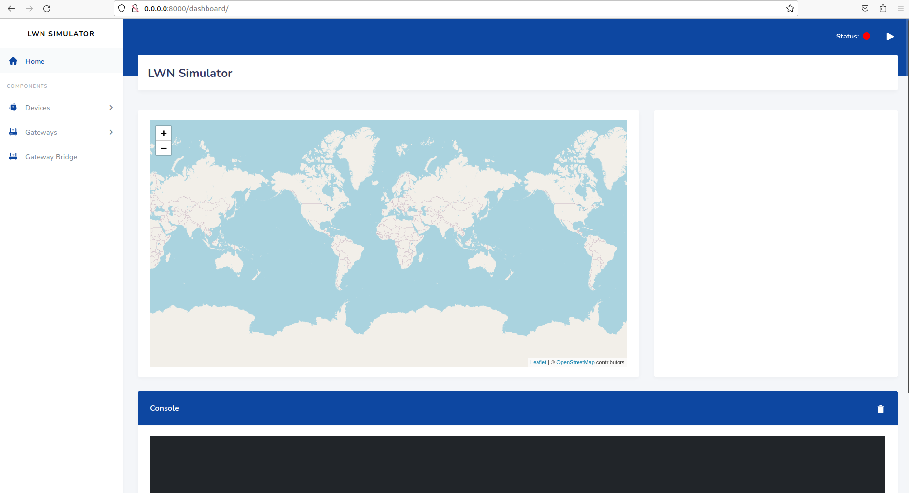

##### Configure Gateway Bridge

The very first step in configuring the LWN Simulator is configuring the Gateway Bridge.

- To configure this navigate to the Gateway Bridge page in the LWN Simulator.
- Add the Gateway Bridge's address. In our case we are using the same machine where we have Azure IoT Operations installed and running and the same machine where we will be running our custom LoRaWAN Broker. For that, we will enter "localhost" as the Gateway Bridge's address.
- Enter the Gateway Bridge's Port. For the port we are going to use 1700.
- Here is how it looks after entering the values for the Gateway Bridge:
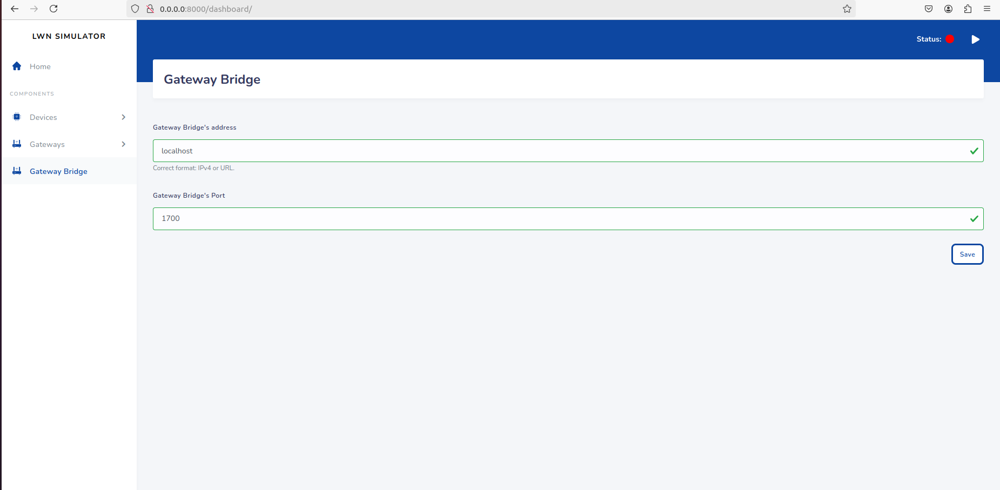
- Hit "Save".

- With this configuration what we are telling the LWN Simulator is to send all the traffic that is coming to LoRaWAN Gateways from LoRa devices to a particular endpoint. In our case this endpoint is localhost and with port 1700.

- This exact endpoint is going to be  used by our custom LoRaWAN Broker to listen to.

##### Add Simulated LoRa device

- To add a simulated LoRa device, click "Devices" under "Components" navigation page and select "Add new device" as shown below:


###### General tab

- On the General tab, enter values for the following fields
- Check the box next to "Active"
- Enter a name for the LoRa device
- For DevEUI, click the button next to the text box for DevEUI. This will generate a new value for DevEUI.
- For region, select the region according to your geographical location. For US select "US915".
- Here is how the General tab looks like after entering the values:
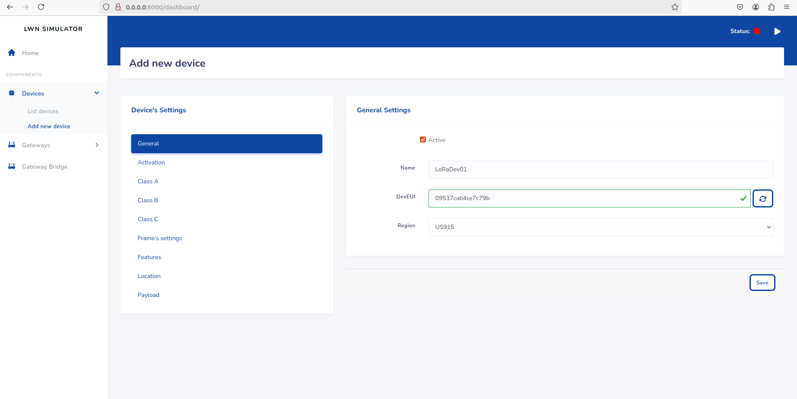
- After entering the values, move to the Activation tab.

###### Activation tab

- On the Activation tab, make sure you have checked "Otaa supported"
- For "App Key", click the button with two arrows next to the App Key text box. This will auto-generate the App key. You can click the "eye" icon button next to reveal the value.
- Here is how the Activation tab looks like:
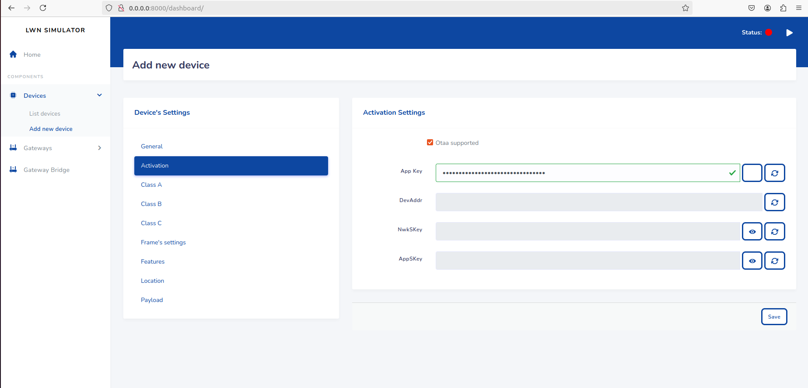
- After completing the activation tab, move to the "Frame Settings" tab.

###### Frame Settings tab

- On Frame Settings tab, keep 0 for the Data Rate, enter 1 for FPort, 1 for Retransmission, 1 for Fcnt under the "Uplink" heading.
- For fields under "Downlink", ensure the checkbox next to "(FCntDown) Disable frame-counter validation" is checked.
- Here is how the Frame Settings tab looks like:
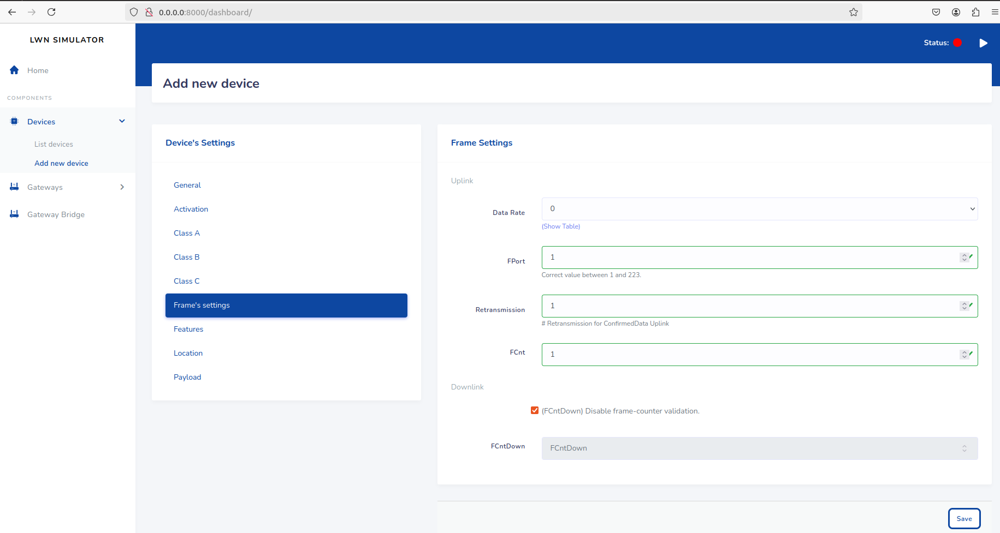
- After completing the activation tab, move to the "Payload" tab.

###### Payload tab

- On the Payload tab, enter 60 as the "Uplink Interval" and any test string for the "Payload" text box, leaving other settings unchanged.
- Here is how the Frame Settings tab looks like:
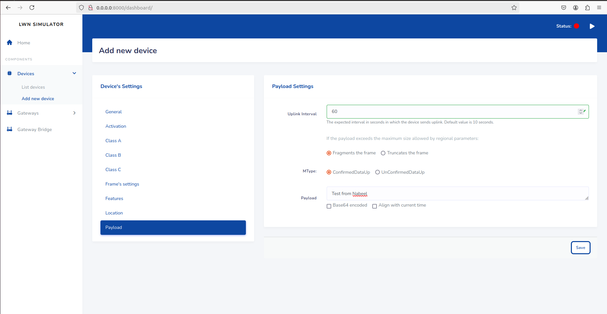
- After completing the Payload tab, hit the "Save" button.

With that a device will appear under List of devices as shown below:
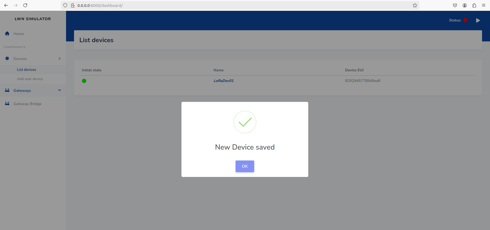

##### Add Simulated LoRaWAN Gateway

###### Add a new Gateway

- Under the "Gateways" navigation page, click "Add new Gateway" as shown below:
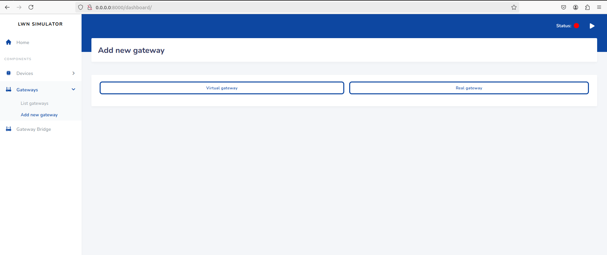
- On the above screen, click "Virtual gateway"

###### Virtual gateway

- On the Virtual gateway screen, ensure that "Active" is checked and enter the name for the LoRaWAN Gateway.
- For MAC Address, click the button with two arrows next to the "Gateway's MAC Address" text box. This will auto-generate a valid MAC Address for the simulated gateway.
- For KeepAlive, you can keep the default value of 30 or, like in our case, 60.
- Here is how it looks like after entering values for Virtual gateway:
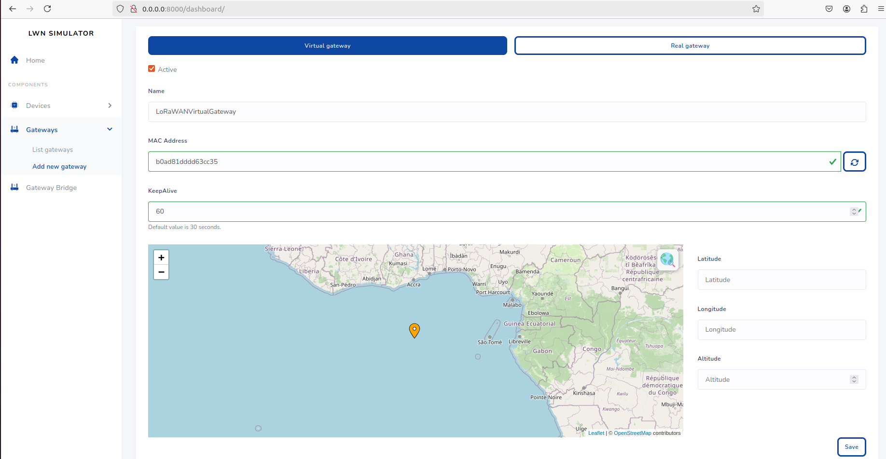
- Hit "Save" to save the changes as a new simulated LoRaWAN gateway.

##### Executing Simulation

- Once you have the Gateway Bridge configured, simulated LoRa device and simulated LoRaWAN gateway added, the home screen will look like the following screenshot:
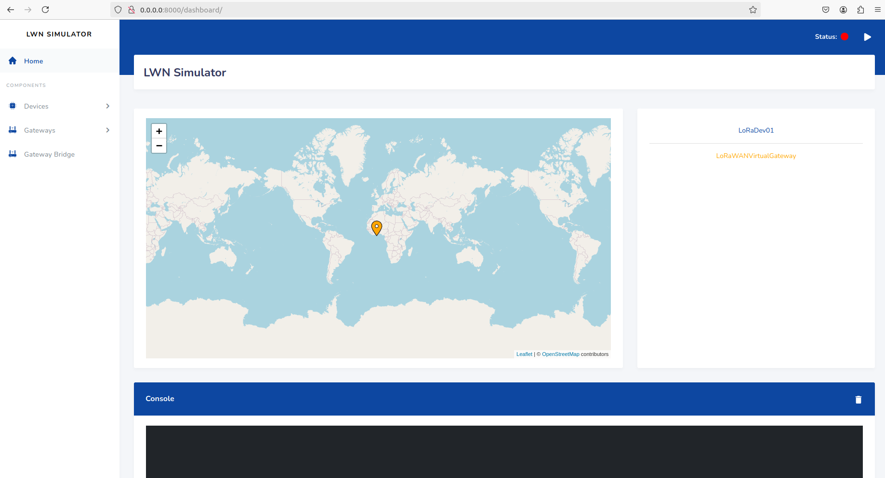
- To execute the simulation, click the ">" button on top right next to "Status:".
- Once the LWN Simulator starts, the status will turn green, and you will start seeing data coming in the console section of the page towards the bottom of the page as shown below:
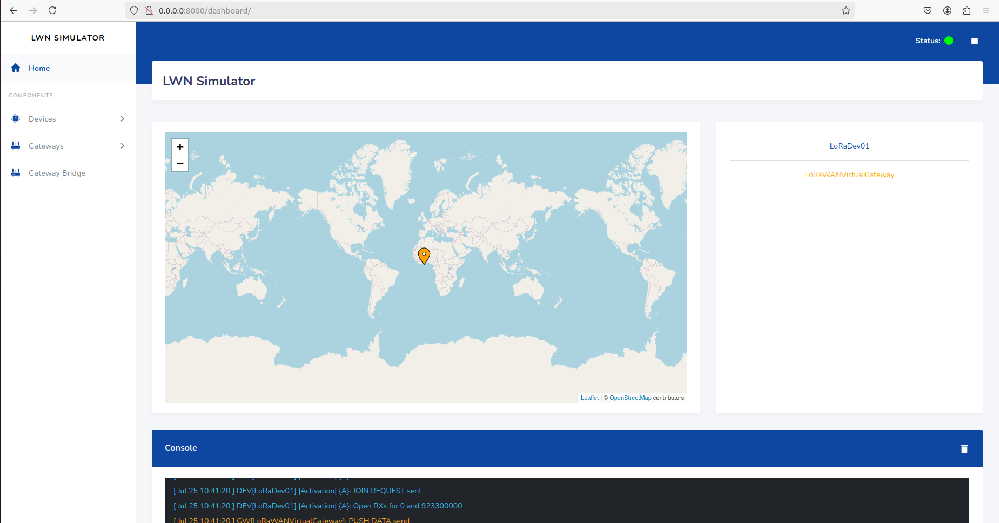
- Please note that we have to keep the simulator running to capture traffic at the custom LoRaWAN Broker end.

### Step 3 - Deploying MQTT Client

#### MQTT Client setup

##### Install MQTT Client

- Open a new terminal and run the following command.

  ```bash
  sudo kubectl apply -f https://raw.githubusercontent.com/Azure-Samples/explore-iot-operations/main/samples/quickstarts/mqtt-client.yaml
  ```

- Here is what the output should look like for the above command:
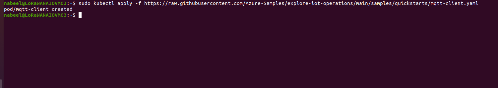

##### Run MQTT Client

```bash
sudo kubectl exec --stdin --tty mqtt-client -n azure-iot-operations -- sh
```

- On the mqttui prompt, enter the following command

```bash
mqttui -b mqtts://aio-mq-dmqtt-frontend:8883 -u '$sat' --password $(cat /var/run/secrets/tokens/mq-sat) --insecure

```

**_NOTE:_**  If you get a 'Network timeout' error on running the above command, you might need to reconfigure your MQTT client by running the following command again:

```bash
sudo kubectl apply -f https://raw.githubusercontent.com/Azure-Samples/explore-iot-operations/main/samples/quickstarts/mqtt-client.yaml

# The above command should yield "pod/mqtt-client configured"
```

- Once you are able to run the mqttui should load up as shown below:
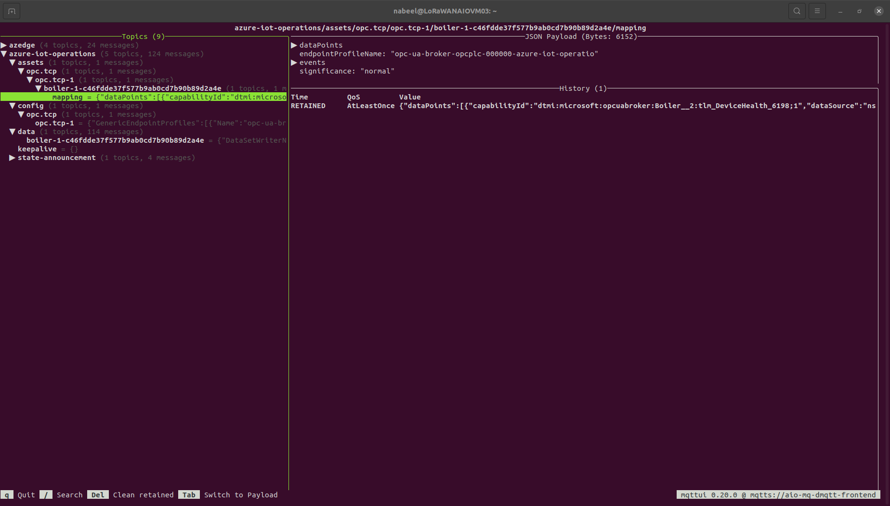

- Keep this terminal open as this is the terminal where we would be able to see raw data coming in from LoRaWAN and making it to Azure IoT Operations topic and then once the data pipelines are done, the processed data sent to a topic.

### Step 4 - Deploying Broker Listener and Port Forwarder

- Open a new terminal window and navigate to lorawan-broker

  ```bash
  cd lorawan-broker/src/

  ```

- Apply the YAML file to your Kubernetes cluster:

  ```bash
  sudo kubectl apply -f non-tls-listener.yaml
  ```

- Once the service is created, you can forward a local port to the service's port:

   ```bash
   kubectl port-forward svc/broker-listener-non-tls -n azure-iot-operations 1883:1883
   ```

   This command forwards local port 1883 to port 1883 on the `broker-listener-non-tls` service.
- Here is how the output would look for the above set of commands:
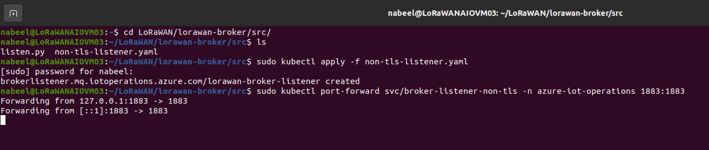

#### [Optional] Further reading

- You can connect to the broker using an MQTT client. For example, using `mosquitto_pub`:

   ```bash
   mosquitto_pub -h localhost -p 1883 -i "test" -t "test" -m '{"test":"test"}'
   ```

- The above is an example command that publishes a message to the `test` topic on the broker. The `-h localhost -p 1883` options specify the hostname and port of the broker. The `-i "test"` option sets the MQTT client ID. The `-t "test"` option sets the topic. The `-m '{"test":"test"}'` option sets the message payload. Please note that running the above command is not required but presented here for detailed clarification on how you can use mqtt client using listener.

**_NOTE:_**  Please note that this listener is not secured with TLS, so it should not be used for sensitive data or in production environments

## Solution Run Steps

### Step 1 - Running LoRaWAN® Broker

- Open a new terminal window and browse to lorawan-broker

  ```bash
  cd LoRaWAN/lorawan-broker/src/

  python3 listen.py

  ```

- The screen start showing the data that the LoRaWAN Broker will post.
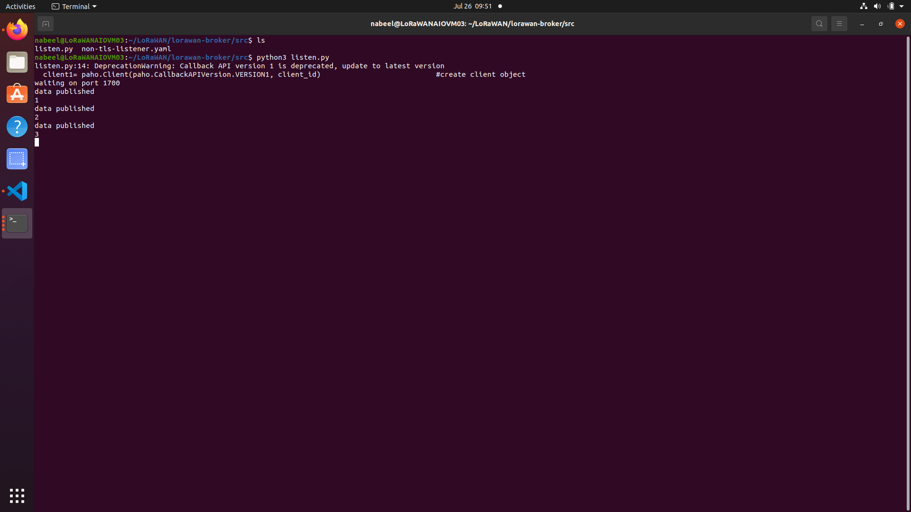

- Here is how the MQTTUI screen will show the data:
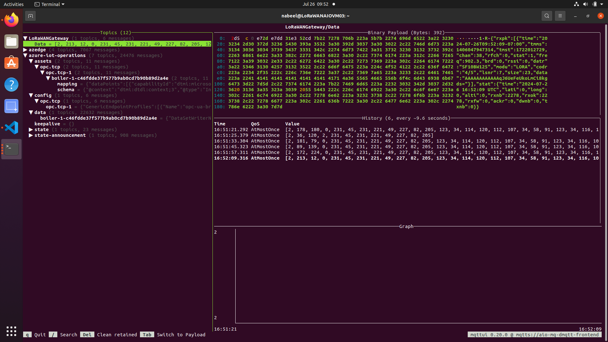

### Step 2 - Building Data pipeline using Azure IoT Operations

#### Checklist before building

- LWN-Simulator is deployed and running.
- MQTTClient is deployed and running.
- Broker listener and port forwarder have been established.
- LoRaWAN custom broker is up and running.

#### Creating a data pipeline

- Open a new browser window and browse to Digital Operations Experience at: <https://iotoperations.azure.com/>
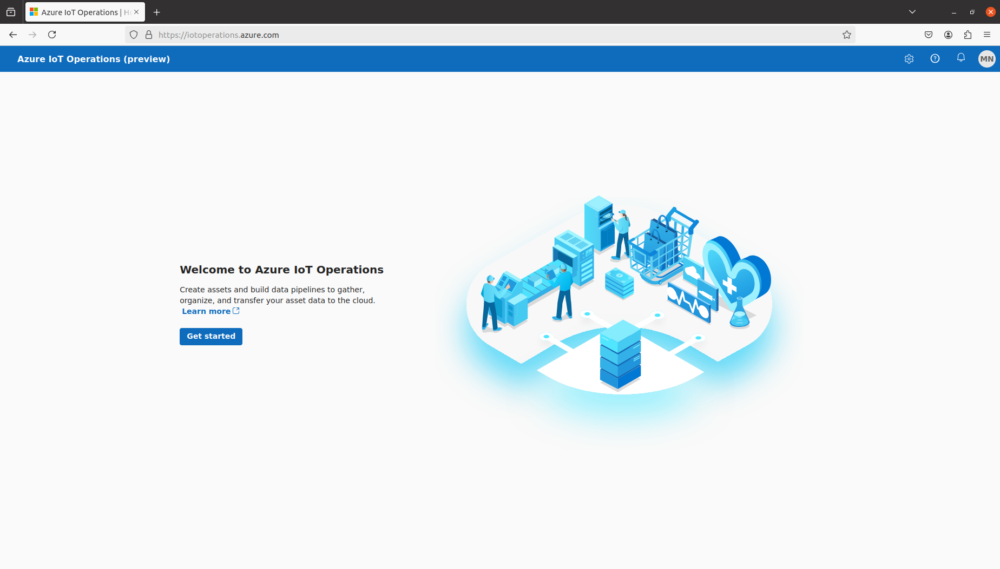
- Clicking the "Get started" button, will take you to the sites page as shown below:
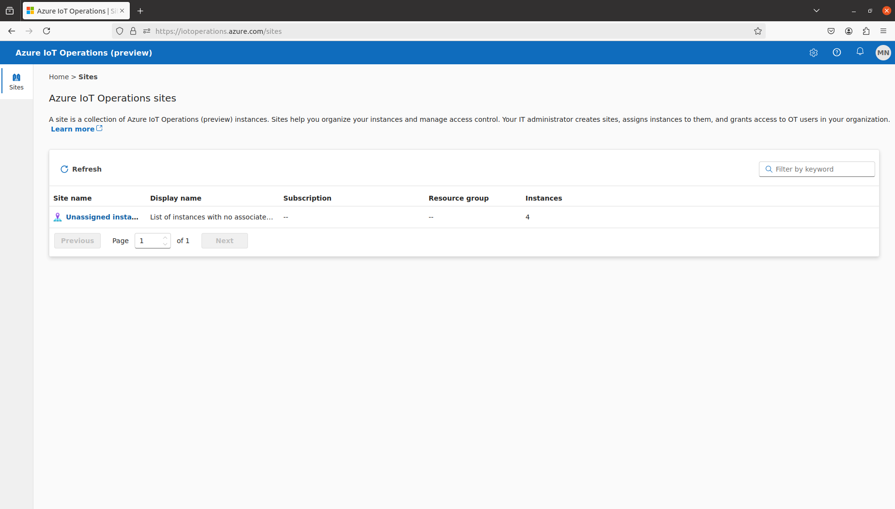
- Click the "Unassigned instances" link to view Azure IoT Operations instances as shown below:
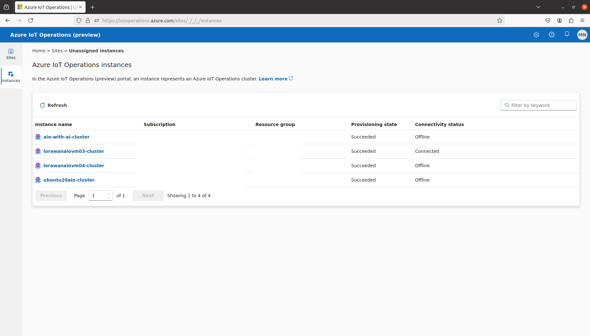
- Click the Azure IoT Operations instance that you have  created as part of the Step 1. Since I used "lorawanaiovm03-cluster" as the cluster name in Step 1, I will select "lorawanaiovm03-cluster" from the previous screen and get the following screen:
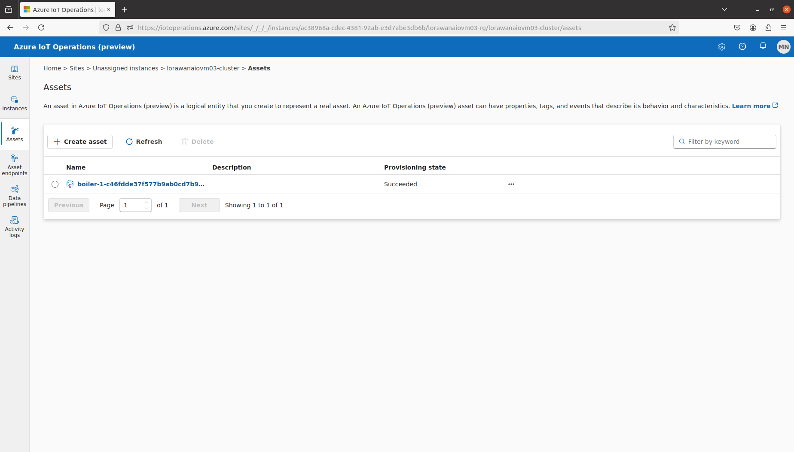
- This will take you to the "Assets" page. On the "Assets" page, click "Data pipelines" on the left navigation menu.
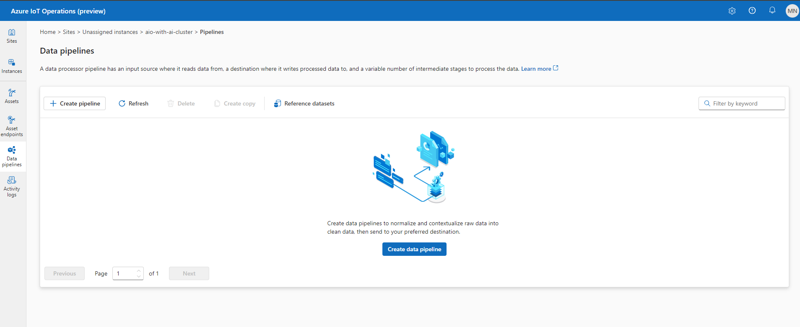
- On the "Assets" page, click "Create pipeline".
- On the "Create pipeline" page, click "< pipeline name >" link on top.
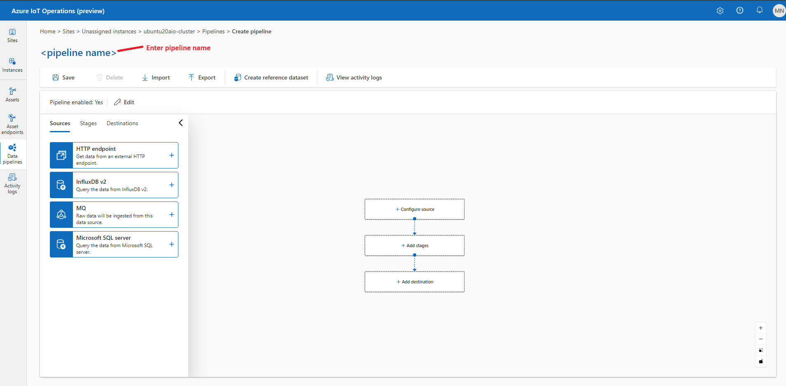
- On right side enter the name of pipeline and the description as shown below:
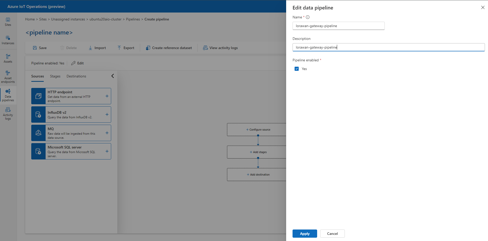
- Click "Apply"
- Our next step is to configure the source. For that click the "+Configure source" button on the screen and choose "MQ" as shown below:
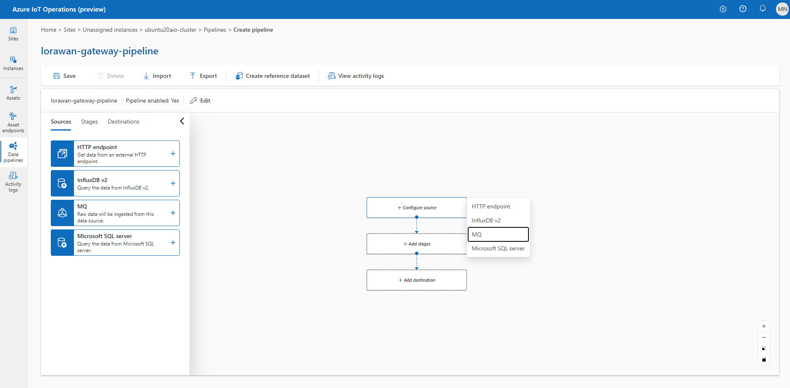
- On the "Source: MQ" page, enter the values for Name, Description, Topic and Data format as shown below:
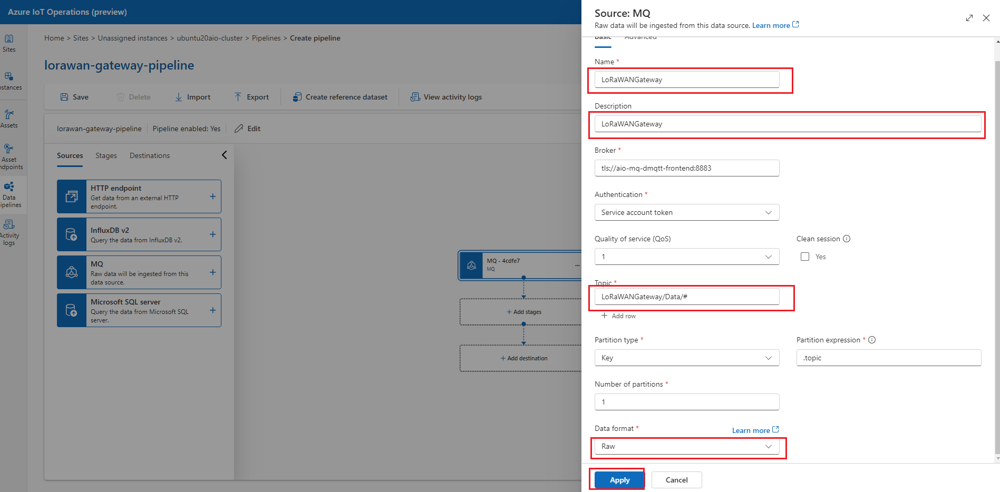
- The topic name is the same topic name that is provided in the LoRaWAN broker.
- It is important to note that since the LoRaWAN Gateway is using UDP protocol, we have to use "Raw" as the data format.
- Click "Apply".
- Our next step is to configure "+Add stages". Click "+Add stages" and choose "Transform" as shown below:
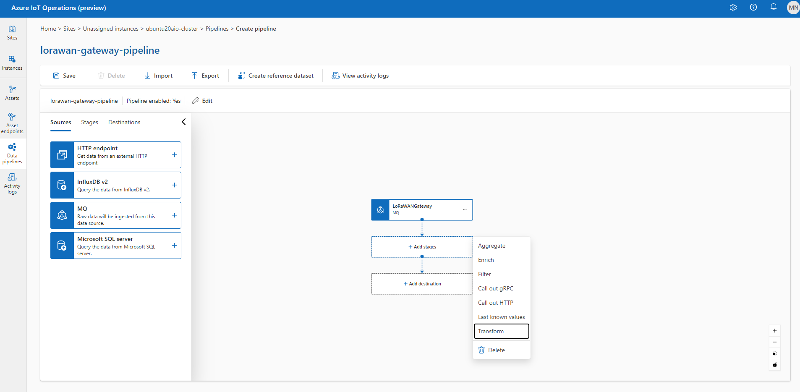
- On the "Stage: Transform" page, enter the name and description. Please make sure JQ Expression is kept with "." as shown below:
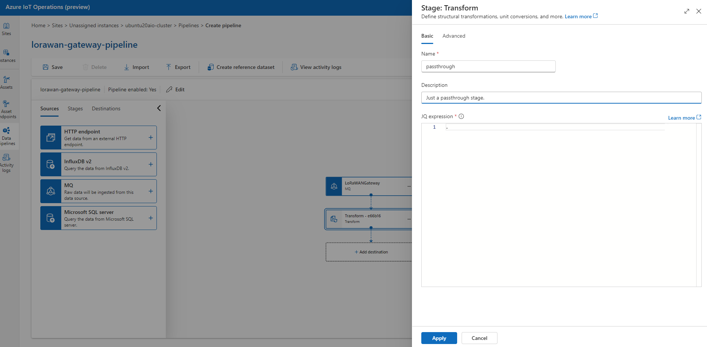
- As the name that we entered above suggests, the purpose of the stage is just have a passthrough. It will get data from previous step and send it to the next step without making any changes.
- The next and final step in creating the data pipeline is to add the destination. Click the "+Add destination" button and choose "MQ" as the destination as shown below:
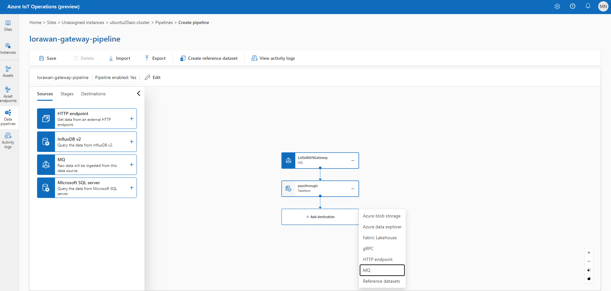
- On the "Destination: MQ" page, provide: Name, Description, Topic as "ProcessedLoRaWANData", Path as ".payload" and Data format as "Raw" as shown below:
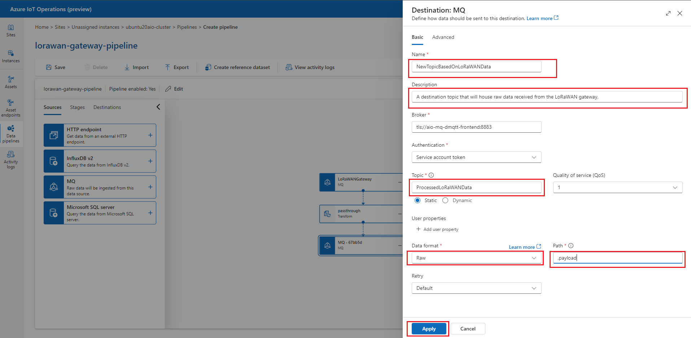
- Please make note of the Topic name that is entered above. This will be the output topic that we will get when this pipeline processes data coming from the LoRaWAN gateway.
- Click "Save" to save the data pipeline as shown below:
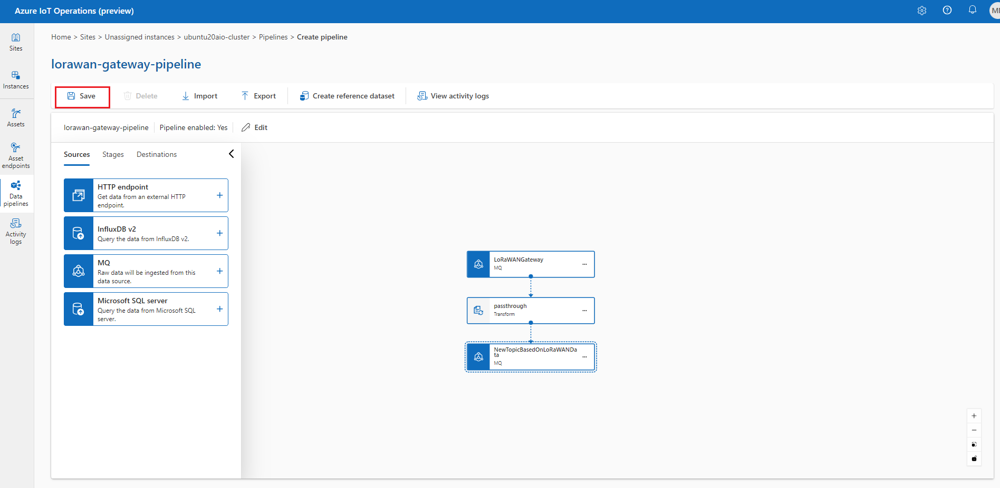

#### Viewing data

- Once the data pipeline is established, it will start pumping data into the "ProcessedLoRaWANData" topic as mentioned in the previous steps.
- Here is how it will look like on the MQTTUI window:
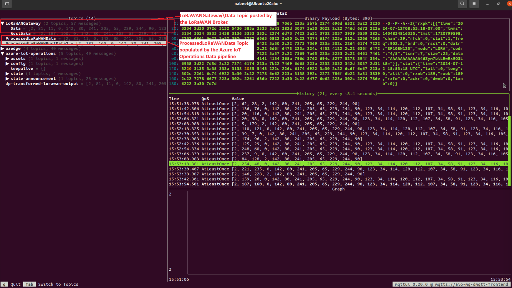

## Conclusion

We have seen how we can take UDP data generated by the LoRaWAN Gateway and use it with Azure IoT operations using our custom-built LoRaWAN Broker.
