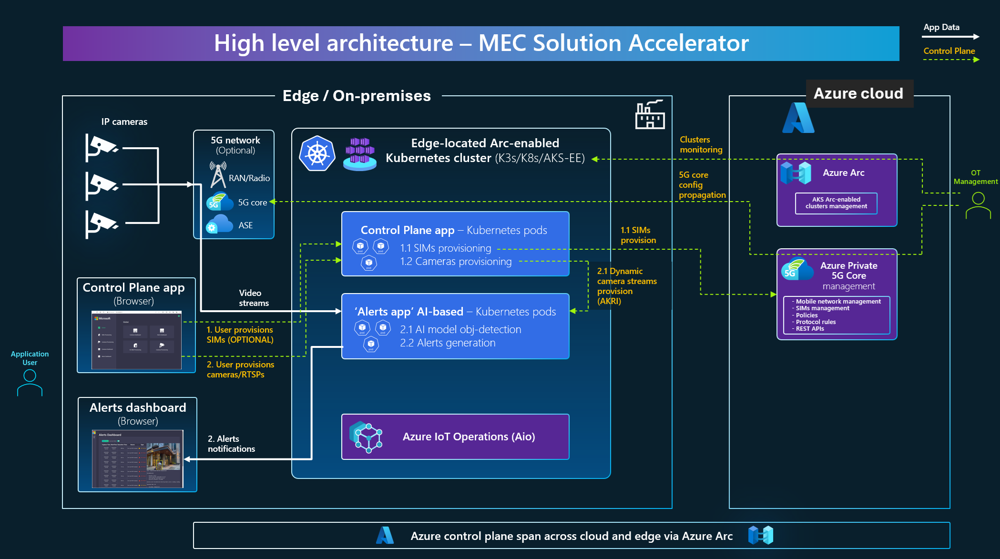
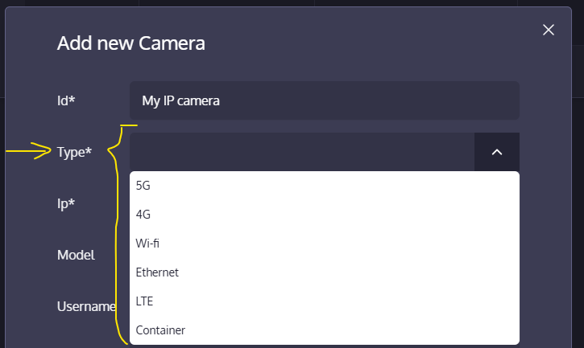

## Overview

### Create live video analytics at the edge with 'MEC app solution accelerator' based on Azure IoT Operations (AIO)

"Contoso Energy", a fictional company, requires a live video analytics at the edge (in its plants) with alerts dashboards and dynamic provisioning of any number of IP video cameras at the MEC (Multi-access Edge Compute through 5G, Wi-Fi or Ethernet) to provide real-time alerts on issues detected by AI models analyzing the video streams.

In a Private MEC (Multi-access Edge Compute) that needs to cover large outdoor/indoor industrial areas, the best fit is to use a private 5G network with 5G video cameras. However, in other use cases Wi-Fi or Ethernet networks can also be used instead of a 5G network.

### Introduction video

You can get an overview of this application's functionality by watching the following video.

**Important**: Note that the 5G cellular network is optional. You can also try this application with Wi-Fi cameras, Ethernet cameras and even a camera simulator with an RTSP video stream Docker container (pod in Kubernetes) provided out-of-the-box with the application.

<video src="https://private-user-images.githubusercontent.com/1712635/329047025-3dfdf79c-d3b1-493b-935b-6cb52d7a9729.mp4" controls="controls" style="max-width: 640px;">
</video>

### Goals for the 'MEC app solution accelerator' (This example application)

The application network needs are fullfilled by the infrastructure, requirmentes such as a 5G network or Wi-Fi and edge compute. Deciding for one or another type of network usually depends on the business use case (i.e. large outdoor cover vs. smaller indoor offices cover, or best-in-class network reliability without interferences). 

However, aspects such as being able to create a light microservices architecture and event-driven application (**Devices-->AI Model inference-->Events-->Logic-->Alert -->Alert Handlers**) need to be implemented by you as developer and it's precisely the value that this example application provides:

- Recommendations on using event-driven and microservices architecture as implemented by this example application.
- Showcase of design patterns to implement (Event Pub/Sub, microservices autonomy, extensible events/alerts metadata schemas, etc.).
- Show how to inference with deep-learning models from a microservice, in this case using 'Yolo', for video/image analytics, then generate the related detection event.


### High level modules architecture

The solution involves the following high level modules or related applications:

- A control-plane application in charge of:
  - Dynamically provision video cameras (n cameras).
  - (Optional) Dynamically provision of related 5G SIMs, if using a 5G network with Azure Private 5G Core.

- A video analytics and event-driven alerts system in charge of:
  - Scalable video stream ingestion (n streams).
  - Scalable object/issue detection based on an AI model.
  - Alert rules engine to determine if an event should be really an alert.
  - Alerts dashboard UI.

  Below you can see a high-level diagram with the above modules and interaction:

  

You can see how the control plane app drives the actions related to provisioning assets such as cameras or SIMs (dotted lines in yellow), while the 'Alert app' is the live system consuming the video streams and detecting issues/alerts with the AI model (lines in white).

### Internal software architecture of the MEC Aplication Solution Accelerator

The internal software architecture (event-driven and microservice oriented architecture) and development technology details are explained in detailed in this page:

  

For further details and explanations about the internal cloud native and microservices architecture and technologies used, please go to the following page in the source-code original repo at GitHub: 

[MEC-Accelerator Internal Software Architecture details](https://github.com/Azure/mec-app-solution-accelerator/blob/main/docs/ARCHITECTURE_MEC_ACCELERATOR.md)


## Functional features of the application

Once the application is deployed into Kubernetes, as mentioned in the high-level modules architecture, there are two main work areas, showcased below.

### Control Plane app UI

The home page of this app basically shows you the main actions you can do from here:

  


#### (OPTIONAL) 5G SIMs provisioning

As mentioned, this configuration is optional. If you are not using any cellular 5G network, you can also use Wi-Fi or ethernet, as alternatives.

When you click on the 'SIMs Provisioning' menu option, the application will show you the list of SIMs already provisioned in your Azure Private 5G Core network. That information is coming directly from Azure Private 5G Core thorugh its REST APIs.

  

The value-added provided by this UI integrated to Azure Private 5G Core is that any regular business application operator can provisiong SIMs without having access to the Azure subscription/portal as an administrator or technical person.

User operators can easily delete or add new SIM cards to the cellular 5G network by providing the typical SIM data:

  

It's very straightforward because even the IP to be provided comes from the a query to AP5GC with a pool of available IPs. Also the available SIM groups and SIM Policies to assign to.

#### Dynamic provisioning of IP video cameras

The most important asset to provision are the video cameras. This application allows to dynamically provision 'n' number of IP cameras without having to update any code or configuration settings. A user can directly do it from the UI and the pods in Kubernetes will dynamically support the new stream ingestion, as in the following screenshots.

Firstly, you select the type of te IP camera. It can be 5G, Wi-Fi, Ethernet and even an example out-of-the-box pod/container we provide for quick testing:

  

In the case you have a 5G camera, it's very straigthforward because the app queries the SIMs available in the 5G core, so you simply have to select any available SIM and that will get it's related IP:

  

The important camera's value in that configuration is the RTSP Uri. The rest of the values are simply to make it easier to construct the Uri, but if you know the Uri of your IP camera, you can also directly provide it, including for Wi-Fi or Ethernet IP cameras, not just 5G cellular cameras.

Once you add any camera to the system you can check that it's working in the 'Cameras dashboard' page:

  


### Alerts dashboard app UI

Finally, but as the most important feature of this application, you can see the alerts being triggered and originally detected by the AI model analyzing the video, as in the below screenshot which is detecting a person and showing that fact within a bounding-box:

  


Since these alerts are internally defined as messages going through a MQTT broker following a Publish/Subscription pattern, you could easily extend this application and propagate these alerts as emails, text messages or to any other business system related to alerts.


## Prerequisites

There are a few infrastructure prerequisites explained in the following sections.

### Supported infrastructure environments at the edge

This version of MEC-App-Accelerator supports the following Kubernetes distributions and host operating system.

- **AKS Edge Essentials on Windows**
- **K3s on Ubuntu Linux**

Additionally and on top of the Kubernetes/k3s cluster, you need to install **Azure IoT Operations**, related to the following assets:

  - IoT MQ as messaging broker
  - AKRI for dynamic cameras provissioning (Curently using the AKRI OSS version).

### Install the Kubernetes/K3s cluster at the edge

Install the AKS-EE-Windows cluster or the K3s-Ubuntu cluster by following the instructions in the below Microsoft official doc.

**A. Install AKS-EE-Windows alternative:** 

[Create your Azure Arc-enabled Kubernetes cluster on Windows](https://learn.microsoft.com/en-us/azure/iot-operations/deploy-iot-ops/howto-prepare-cluster?tabs=aks-edge-essentials)

**B. Install K3s-Ubuntu-Linux alternative:** 

[Create your Azure Arc-enabled K3s cluster on Ubuntu-Linux](https://learn.microsoft.com/en-us/azure/iot-operations/get-started/quickstart-deploy?tabs=linux#connect-a-kubernetes-cluster-to-azure-arc)


### Install Azure IoT Operations into your Kubernetes cluster

#### Prerequisites for Azure IoT Operations

It's important to check and install the prerequisites for Azure IoT Operations explained here:

[Prerequisites for Azure IoT Operations](https://learn.microsoft.com/en-us/azure/iot-operations/get-started/quickstart-deploy?tabs=windows#prerequisites)

#### Deploy Azure IoT Operations

Install Azure IoT Operations by following the official "simplified/automated approach" documentation here:

[Deploy Azure IoT Operations Preview](https://learn.microsoft.com/en-us/azure/iot-operations/get-started/quickstart-deploy?tabs=windows#deploy-azure-iot-operations-preview)


### Clone the MEC-Accelerator GitHub repo

You need to clone the MEC-Accelerator GitHub repo in the client machine from where you will deploy the application against your Kubernetes/k3s cluster.

Basically, you need to have the cloned repo in the same machine from where you also use KUBECTL against your K8s/K3s cluster.

Logically, you need to have [installed Git](https://git-scm.com/downloads) in the first place.

Then, using a command-line tool (PowerShell in Windows or Bash in Linux) clone the repo:

```shell
git clone https://github.com/Azure/mec-app-solution-accelerator.git
```


## Getting Started

### Deploy the MEC Application Solution Accelerator into your Kubernetes cluster at the edge


#### Go to the deployment folder

From the console, move to the deployment folder within the cloned repo:

```shell
cd <YOUR PATH>/deploy/k8s
```

#### (OPTIONAL) Update the application control plane configuration for accesing your Azure Private 5G network

Update the config map that contains essential information for connecting to our Azure Mobile Network. You'll find the configuration in the file `deploy/k8s/12-control-plane-api-config-map.yaml`.

Replace the following values in the file:

```yaml
  MobileNetwork__SubscriptionId: "your_subscription_id"
  MobileNetwork__ResourceGroup: "your_resource_group"
  MobileNetwork__Name: "your_network_name"
  MobileNetwork__AttachedDataNetwork: "your_attachedDataNetwork_fullID"
  MobileNetwork__Slice: "your_slice_fullID"
  ClientCredentials__TenantId: "your_tenant_id"
  ClientCredentials__ClientId: "your_client_id"
  ClientCredentials__ClientSecret: "your_client_secret"
```

*Note:* This step is required if you want to manage SIMs provisioning from this app against AP5GC (Azure Private 5G Core) in Azure. 

However, if you will only use IP cameras of type Wi-Fi, Ethernet our our example video stream RTSP container for testing, you can skip this part if you don't have an Azure Private 5G Core Mobile Network and packet core deployed into an ASE, RAN, 5G UEs, etc.

#### Check your kubectl context

Make sure that your default kubectl context is pointing to the right cluster: 

  Open a new command-shell and run the following command to check your current contexts:

  ```powershell
  kubectl config get-contexts
  ```

  To set the context to point to the right Kuberentes cluster, use kubectl and provide the name of the context to use:

  ```powershell
  kubectl config use-context [my-cluster-context]
  ```


#### Run the application deployment script

Within the `deploy/k8s` folder there are two Script files, one for Windows and one for Linux that handle the application  deployment into the cluster, including dependencies such as Dapr and AKRI.

The script will run the following deployment steps:

- Install Dapr and Helm.
- Initialize mec-accelerator namespace in the cluster where all the resources will be deployed.
- Install Akri with the specific version depending on the Kubernetes distro used (k8s/k3s).
- Deploy the selected MQTT broker.
- Deploy the rest of the accelerator resources (microservices pods).

The script needs two arguments to be provided depending on the cluster type and the MQTT broker selected:

- **Kubernetes distro:** The `kubernetesDistro` parameter supports Kubernetes and K3s. Supported choice arguments are `k8s` and `k3s`.

- **MQTT broker:** The `mqttBroker`  parameter supports Azure IoT MQ broker (aka. E4K) and Mosquitto. Supported choice arguments are `E4K` and `mosquitto`.

Note that if using Azure IoT MQ broker, **Azure Arc** and **Azure IoT Operations** must be installed in the cluster based on the provided initial instructions above.

**IMPORTANT:** The application setup script needs to be executed on the same machine/environment where you would typically run KUBECTL against your cluster, so it can be on the same cluster's machine (i.e. where you have installed AKS Edge Essentials) or on any client machine able to use KUBECTL against your k3s/Ubuntu-VM cluster.

#### OPTION A: Execute the script in Windows

Execute the script `deploy-accelerator.ps1` while providing the selected parameters:

For deploying into AKS Edge Essentials or a plain K3S in an Ubuntu-Linux, with Azure IoT MQ (aka.E4K), the command is the following:

```powershell
.\deploy-accelerator.ps1 -kubernetesDistro k3s -mqttBroker E4K
```


#### OPTION B: Execute the script in Linux

Execute the script `deploy-accelerator.sh` while providing the selected parameters: 

For deploying into AKS Edge Essentials or a plain K3S in an Ubuntu-Linux, with Azure IoT MQ (aka.E4K), the command is the following:

```powershell
./deploy-accelerator.sh --kubernetesDistro k3s --mqttBroker E4K
```

Basically, the only difference in usage should be the script file name (**.ps1** vs. **.sh**).

Here's an example of the application's setup script execution:

  


#### Try the 'Control Plain app' to provision cameras

In order to know the URL for the 'Control Plain web app' (IP and port to use), type the following command:

```powershell
kubectl get services --namespace mec-accelerator
```

  

Then search for the service with name **"control-plane-ui-service"** and related IP and external port, so you write a URL similar to the following in a browser:

`http://<your-IP>:90/`

  


#### Access the Alerts dashboard UI with Alerts originated from AI model detections

To access the Alerts dashboard app you need to know its URL (IP and port to use). Type the following command to discover that URL:

```powershell
kubectl get services --namespace mec-accelerator
```

  

Then search for the service with name **"alerts-ui"** and related IP and external port, so you write a URL similar to the following in a browser:

`http://<your-IP>:88/`

Alternatively, you can also click on the link "Alerts Dashboard" from the Control-Plane app here:

  


Following any of those ways you should be able to run the 'Alerts dashboard UI' and check out the Alerts originated from the AI models when analyzing the video coming from the cameras you need to provision in the first place:

  


#### Uninstall the MEC-Application from Kubernetes 

In order to remove the application from your Kubernetes cluster, follow these simple steps:

- Open a new command-shell and change the current folder to the `deploy/k8s` folder of this repo.

- Run the `deploy-accelerator` script with the **uninstall** parameter to remove all related application's resources from Kubernetes.

Windows:

```powershell
.\deploy-accelerator.ps1 -uninstall
```

Linux:

```powershell
.\deploy-accelerator.sh -- uninstall
```


## Resources

For more detailed information about the 'MEC Application Solution Accelerator', review the following resources:

- [MEC Application Solution Accelerator GitHub repo](https://github.com/Azure/mec-app-solution-accelerator)


## Contributors

This Jumpstart Drop was originally written by the following contributors:

- [Cesar De la Torre | Principal Program Manager at Microsoft](cesardl@microsoft.com)