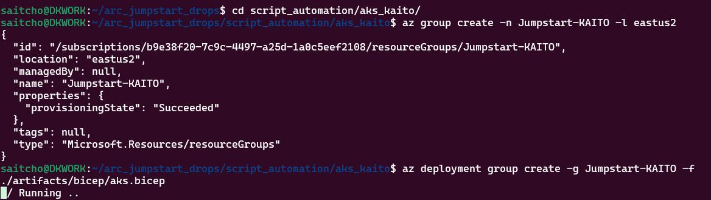
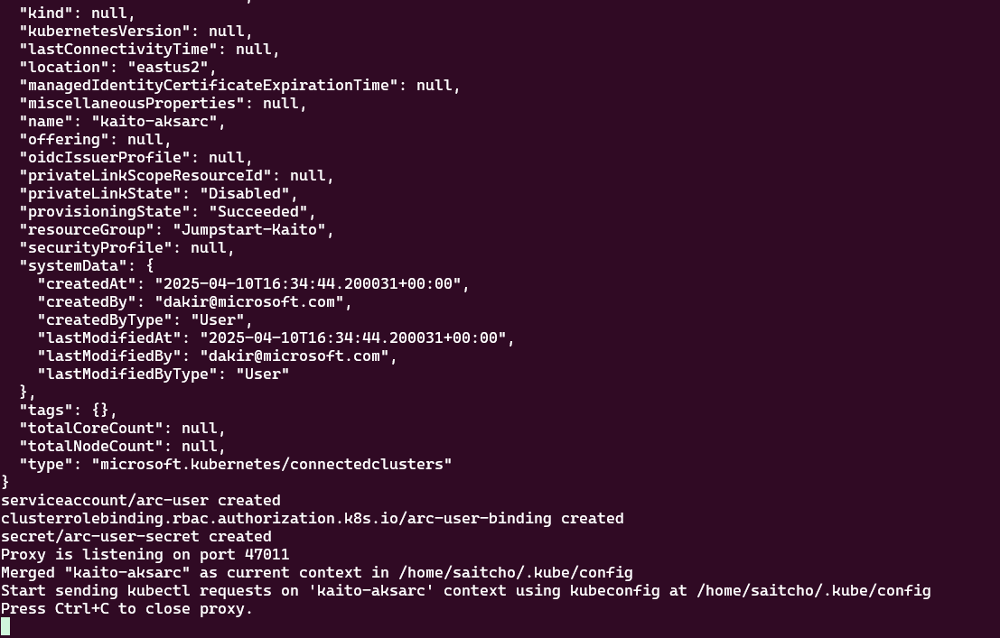
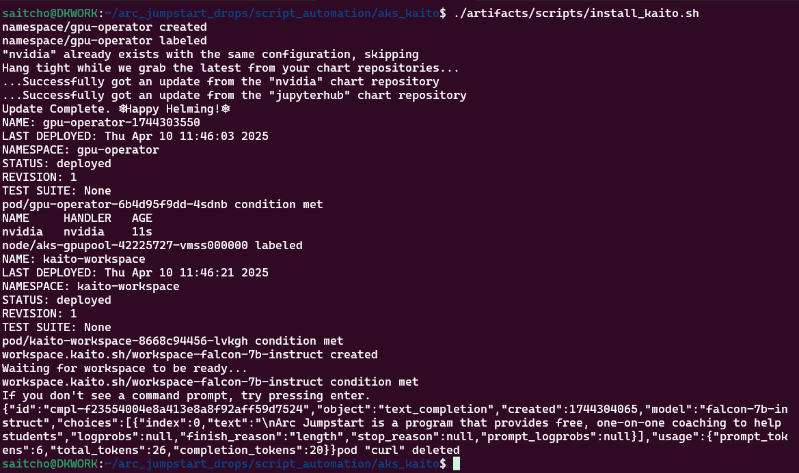
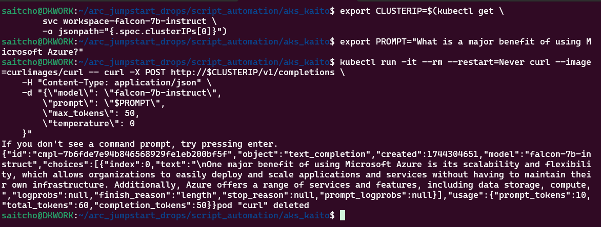

# Exploring KAITO enabled by Azure Arc

## Introduction

This guide provides a quick way to explore [KAITO](https://github.com/kaito-project/kaito) enabled by [Azure Arc](https://learn.microsoft.com/azure/aks/aksarc/deploy-ai-model?tabs=portal). The guide includes a optional Bicep template for setting up an Arc-enabled cluster with a GPU node by using AKS. You can also use your own Kubernetes cluster and GPU if desired with some modifications to the script. You can see a quick demo of the results of the script in [this video](https://www.youtube.com/watch?v=Kef9WFyCeQA).

## Prerequisites

Before you begin, ensure you have the following:

* An Azure subscription with access to Azure Kubernetes Service (AKS) and Azure Arc.
* Available NCSv12 or other GPU quota in your Azure subscription OR bring your own Kubernetes cluster with GPU.
* Access to the code by cloning [the Jumpstart Drops repo](https://github.com/Azure/arc_jumpstart_drops) to a local dev folder.
* Azure CLI installed and logged into the Azure subscription you will use.

## Step-by-Step Guide

### Step 1: Deploy a Kubernetes environment with GPU

> **Note:** If you already have a Kubernetes cluster with an available GPU node pool. skip to Step 2.

Setup an AKS cluster to simulate an on-premises cluster and GPU. For this Bicep template, you will need Compute quota for 24 Standard_NCSv3 series vCPU. The script was tested in Azure regions East US and East US 2.

Open a Bash shell where you cloned the [GitHub repository](https://github.com/Azure/arc_jumpstart_drops). From the shell, run the following commands to create an Azure resource group and begin a deployment of AKS using a Bicep template.

    ```shell
    cd ./script_automation/aks_kaito
    az group create -n Jumpstart-KAITO -l eastus2
    az deployment group create -g Jumpstart-KAITO -f ./artifacts/bicep/aks.bicep
    ```

Once the deployment completes, continue to the next step.



### Step 2: Arc-enable the cluster

After the cluster is deployed, edit the _infra/scripts/install_arc.sh_ script to adjust the Azure resource group name to match the one you used in your deployment.

    ```shell
    chmod 700 ./artifacts/scripts/install_arc.sh
    ./artifacts/scripts/install_arc.sh
    ```
Running this script requires an interactive login with Azure so login when prompted. After logging in, the script will onboard your cluster as an Arc-enabled cluster and then open a proxy connection to the remote cluster using the cluster connect feature of Arc-enabled Kubernetes. Leave this connection open and do not press Ctrl-C until finished with the exercise.



### Step 3: Deploy KAITO and a falcon-7b-instruct model and ask a question

Next, open a new shell. Run the install_kaito.sh script deploy KAITO and ask an LLM a question.

    ```shell
    cd ./script_automation/aks_kaito
    chmod 700 ./artifacts/scripts/install_kaito.sh
    ./artifacts/scripts/install_kaito.sh
    ```


### Step 4: Prompt the model

You can send your own prompts to the model using simple shell commands. Use the example below to send your own prompts.

    ```shell
    # Get the cluster IP
    export CLUSTERIP=$(kubectl get \
        svc workspace-falcon-7b-instruct \
        -o jsonpath="{.spec.clusterIPs[0]}")

    # Set the prompt
    export PROMPT="What is a major benefit of using Microsoft Azure?"

    # Prompt the model
    kubectl run -it --rm --restart=Never curl --image=curlimages/curl -- curl -X POST http://$CLUSTERIP/v1/completions \
    -H "Content-Type: application/json" \
    -d "{\"model\": \"falcon-7b-instruct\",
        \"prompt\": \"$PROMPT\",
        \"max_tokens\": 50,
        \"temperature\": 0
    }"
    ```



## Troubleshooting

* **GPU Quota Issues**: If you encounter GPU quota issues, request quota relief through the appropriate channels. Ensure that your subscription has access to the necessary GPU resources.

* **Deployment Failures**: If KAITO fails to deploy, inspect the pod logs using kubectl for more details on the errors.

## Further learning

* Check out the [KAITO](https://github.com/kaito-project/kaito) repository for more examples and use cases to try.
* Learn about the [KAITO AKS extension](https://learn.microsoft.com/en-us/azure/aks/aks-extension-kaito)
