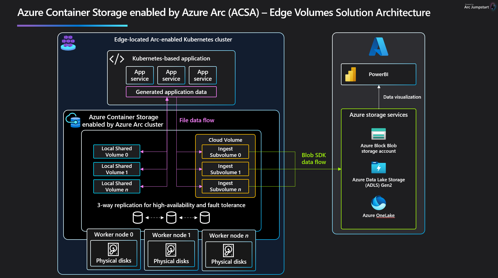

# Azure Container Storage enabled by Azure Arc: Cloud Ingest Edge Volume on a Single Node Ubuntu K3s Cluster with an SFTP Front End
This example can be used to install Azure Container Storage enabled by Azure Arc to provide a ReadWriteMany Cloud Ingest Edge Volume on an Ubuntu system with K3s and an SFTP front end. This allows you all the functionality of the base product as well as being able to accept writes from SFTP clients. 
Cloud Ingest edge volumes will transfer files saved to the volume to cloud and purge the local copy, according to your ingest policy. 

> ⚠️ **Disclaimer:** Azure Container Storage enabled by Azure Arc: Edge Volumes is currently in public preview. Access to the feature is limited and subject to specific terms and conditions. For further details and updates on availability, please refer to the [Azure Container Storage enabled by Azure Arc Documentation](https://learn.microsoft.com/en-us/azure/azure-arc/container-storage/).

# Architecture


# Prerequisites
* Ubuntu 22.04 or similar VM or hardware that meets [ACSA requirements](https://learn.microsoft.com/en-us/azure/azure-arc/container-storage/prepare-linux#minimum-hardware-requirements)
  * Standard_D8ds_v4 VM recommended
  * Equivalent specifications per node:
    * 4 CPUs
    * 16GB RAM
  * 14G of free disk space in /var

* Installation of [K3s](https://docs.k3s.io/quick-start)

A sample [setup_env.sh](setup_env.sh) script is included in the Jumpstart Repository as a guide. 

# Getting Started

## Set your environment variables
Use the following table to determine the values to be used in the export block below. If you exit your shell during configuration before you have completed all the steps, you must re-export the variables before continuing.  

|Variable        | Required Parameter                                             | Example |
|----------------|----------------------------------------------------------------|-----------------|
|YOUR-REGION          | Azure Region you wish to deploy in                             | eastus          |
|YOUR-RESOURCE-GROUP  | The Resource Group you created with the storage account in it  | myResourceGroup |
|YOUR-SUBSCRIPTION    | The Azure Subscription ID you are using                        | nnnn-nnnnnnn-nnn|
|YOUR-CLUSTER-NAME        | The name you would like your ARC cluster to be called in Azure | myArcClusterName|
|YOUR-STORAGEACCOUNT  | The name of the storage account you created                    | myStorageAccount|

```bash
export YOUR-REGION="eastus"
export YOUR-RESOURCE-GROUP="myResourceGroup"
export YOUR-SUBSCRIPTION="your-subscription-id-here"
export YOUR-CLUSTER-NAME="myArcClusterName"
export YOUR-STORAGEACCOUNT="myStorageAccountName"
```

## Apply inotify.max_user_instance increase
Apply this change to increase the inotify space for your Ubuntu system: 

```bash
echo 'fs.inotify.max_user_instances = 1024' | sudo tee -a /etc/sysctl.conf
sudo sysctl -p
```

## Arc Connect Kubernetes
```bash
az connectedk8s connect -n ${YOUR-CLUSTER-NAME} -l ${YOUR-REGION} -g ${YOUR-RESOURCE-GROUP} --subscription ${YOUR-SUBSCRIPTION}
```

## Install package for certificate management
```bash
az k8s-extension create --cluster-name "${YOUR-CLUSTER-NAME}" --name "${YOUR-CLUSTER-NAME}-certmgr" --resource-group "${YOUR-RESOURCE-GROUP}" --cluster-type connectedClusters --release-train preview --extension-type microsoft.iotoperations.platform --scope cluster --release-namespace cert-manager
```

## Install Azure Container Storage enabled by Azure Arc Extension with Config CRD creation
```bash
az k8s-extension create --resource-group "${YOUR-RESOURCE-GROUP}" --cluster-name "${YOUR-CLUSTER-NAME}" --cluster-type connectedClusters --name "acsa-`mktemp -u XXXXXX`" --extension-type microsoft.arc.containerstorage --config feature.diskStorageClass="default,local-path" --config  edgeStorageConfiguration.create=true
```

## Assign role to storage account
```bash
export pid=`az k8s-extension list --cluster-name "${YOUR-CLUSTER-NAME}" --resource-group "${YOUR-RESOURCE-GROUP}" --cluster-type connectedClusters | jq --arg extType "microsoft.arc.containerstorage" 'map(select(.extensionType == $extType)) | .[] | .identity.principalId' -r`
az role assignment create --assignee $pid --role "Storage Blob Data Owner" --scope "/subscriptions/${YOUR-SUBSCRIPTION}/resourceGroups/${YOUR-RESOURCE-GROUP}/providers/Microsoft.Storage/storageAccounts/${YOUR-STORAGEACCOUNT}"
```

## Configure ACSA with an SFTP Front End
For this example, all the necessary components were packaged in deployment.yaml; this includes the PVC creation, the Ingest Subvolume config, and the SFTP setup. Make any necessary changes to deployment.yaml before running it. For more information about the cloud connected storage account setting, see [here](https://learn.microsoft.com/en-us/azure/azure-arc/container-storage/cloud-ingest-edge-volume-configuration?tabs=portal#attach-subvolume-to-edge-volume).

```bash
kubectl apply -f deployment.yaml
```

## Start writing files to your SFTP Server
Let's create a sample file to push through to make sure our server setup is working.
```bash
echo "Hello World! I'm so glad my SFTP front end is working with ACSA!" > testfile1.txt
```

Run the following command to get the IP address of your SFTP server, and note it for the next step:
```bash
kubectl get service
```

Next, we will run the SFTP command. For our example, the user and password are both 'demo,' but you will want to change those to be something meaningful and secure.
```bash
sftp demo@IPADDRESS
```

You'll have to enter your password here.

**From here, you'll need to change directories to the location you specified. In this example, it's /acsa/exampleSubDir.**

Then, we can put our file using:
```bash
put testfile1.txt
```

## Confirm your file is uploaded
Finally, we can go to the Azure Portal and check our specified storage account container in our specified storage account. Our testfile1.txt should be there.
Note: Please keep in mind that we have set up this system with the default Ingest Policy, which waits 5 minutes after a file is written before it will upload it to the cloud. So if you don't see your file right away, just wait a few minutes. Policies can also be altered according to [these instructions](https://learn.microsoft.com/en-us/azure/azure-arc/container-storage/cloud-ingest-edge-volume-configuration?tabs=portal#optional-modify-the-ingestpolicy-from-the-default).