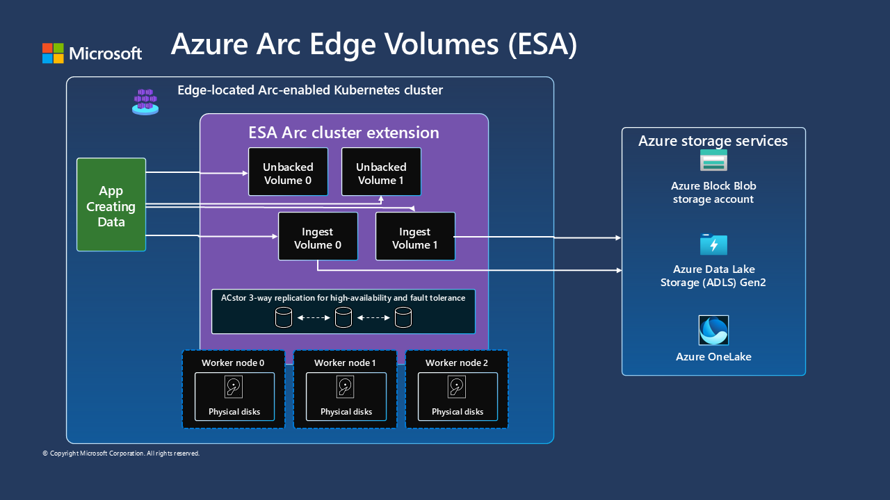

## Overview

#### Azure Container Storage enabled by Azure Arc: Edge Volumes Single Node K3s on Ubuntu
This example can be used to install Azure Container Storage to provide a local unbacked ReadWriteMany Edge Volume on an Ubuntu system with K3s. 

> ⚠️ **Disclaimer:** Azure Container Storage enabled by Azure Arc: Edge Volumes is currently in public preview. Access to the feature is limited and subject to specific terms and conditions. For further details and updates on availability, please refer to the [Azure Container Storage enabled by Azure Arc Documentation](https://learn.microsoft.com/en-us/azure/azure-arc/container-storage/overview).

## Architecture


## Prerequisites
* Ubuntu 22.04 or similar VM or hardware that meets [ACSA requirements](https://learn.microsoft.com/en-us/azure/azure-arc/container-storage/prepare-linux#minimum-hardware-requirements)
  * Standard_D8ds_v4 VM recommended
  * Equivalent specifications per node:
    * 4 CPUs
    * 16GB RAM
  * 14G of free disk space in /var

* Installation of [K3s](https://docs.k3s.io/quick-start)

A sample [setup_env.sh](setup_env.sh) script is included in the Jumpstart Repository as a guide. 


## Getting Started

#### Set your environment variables
Use the following table to determine the values to be used in the export block below. If you exit your shell during configuration before you have completed all the steps, you must re-export the variables before continuing.  

|Variable        | Required Parameter                                             | Example |
|----------------|----------------------------------------------------------------|-----------------|
|REGION          | Azure Region you wish to deploy in                             | eastus          |
|RESOURCE_GROUP  | The Resource Group you created with the storage account in it  | myResourceGroup |
|SUBSCRIPTION    | The Azure Subscription ID you are using                        | nnnn-nnnnnnn-nnn|
|ARCNAME         | The name you would like your ARC cluster to be called in Azure | myArcClusterName|

```bash
export REGION="eastus"
export RESOURCE_GROUP="myResourceGroup"
export SUBSCRIPTION="your-subscription-id-here"
export ARCNAME="myArcClusterName" # will be used as displayname in portal
```

#### Apply inotify.max_user_instance increase
Apply this change to increase the inotify space for your Ubuntu system: 

```bash
echo 'fs.inotify.max_user_instances = 1024' | sudo tee -a /etc/sysctl.conf
sudo sysctl -p
```

#### Arc Connect Kubernetes
```bash
az connectedk8s connect -n ${ARCNAME} -l ${REGION} -g ${RESOURCE_GROUP} --subscription ${SUBSCRIPTION}
```

#### Install and Configure Open Service Mesh
```bash
az k8s-extension create --resource-group ${RESOURCE_GROUP} --cluster-name ${ARCNAME} --cluster-type connectedClusters --extension-type Microsoft.openservicemesh --scope cluster --name osm --config "osm.osm.featureFlags.enableWASMStats=false" --config "osm.osm.enablePermissiveTrafficPolicy=false" --config "osm.osm.configResyncInterval=10s" --config "osm.osm.osmController.resource.requests.cpu=100m" --config "osm.osm.osmBootstrap.resource.requests.cpu=100m" --config "osm.osm.injector.resource.requests.cpu=100m"
```

#### Install aio platform package for certificate management
```bash
az k8s-extension create --cluster-name "${ARCNAME}" --name "${ARCNAME}-certmgr" --resource-group "${RESOURCE_GROUP}" --cluster-type connectedClusters --release-train preview --extension-type microsoft.iotoperations.platform --scope cluster --release-namespace cert-manager
```

#### Install Azure Container Storage enabled by Azure Arc Extension with Config CRD creation
```bash
az k8s-extension create --resource-group "${RESOURCE_GROUP}" --cluster-name "${ARCNAME}" --cluster-type connectedClusters --name "acsa-`mktemp -u XXXXXX`" --extension-type microsoft.arc.containerstorage --config feature.diskStorageClass="default,local-path" --config  edgeStorageConfiguration.create=true
```

#### Configure ACSA for Edge Volumes 
For this example, the components are separate and applied separately, however you can chose to combine them into a single yaml to reduce the number of config files you have to maintain. 

```bash
kubectl apply -f pvc.yaml
kubectl apply -f examplepod.yaml
```

#### Attach to example pod to use /mnt/acsa

```bash
example_pod=`kubectl get pod -o yaml | grep name | head -1 | awk -F ':' '{print $2}'`
kubectl exec -it ${example_pod} -- bash
```

For help, visit [Azure Container Storage enabled by Azure Arc documentation (preview)](https://learn.microsoft.com/en-us/azure/azure-arc/container-storage/).
