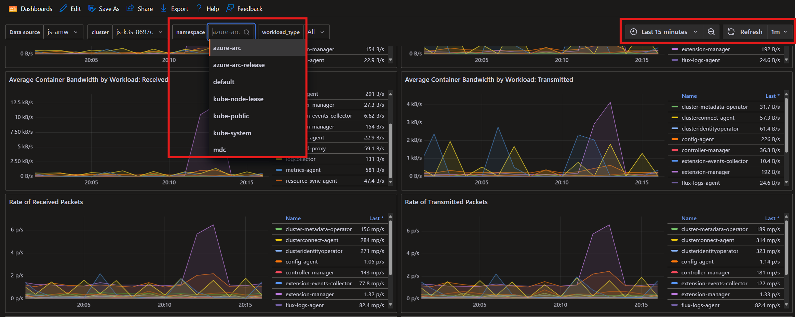

## Overview

#### Enabling Monitoring for Arc-enabled K3s Cluster with Prometheus and Grafana

This Jumpstart guide provides end-to-end automation to deploy a lightweight Kubernetes (K3s) cluster, onboard it to Azure Arc, and enable monitoring using Prometheus and Grafana with Azure Monitor Dashboards. The automation script installs all required dependencies, sets up configures Azure monitor extension for metrics collection, and Grafana for visualization. This setup ensures you have comprehensive observability for your Kubernetes environment, whether running in the cloud or on-premises.

> **Note:** This Jumpstart guide demonstrates how to set up and use [Grafana](https://grafana.com/) with Azure Monitor Dashboards.

> ⚠️ **Disclaimer:** Grafana with Azure Monitor Dashboards is currently in public preview. For further details and updates on availability, please refer to the [Grafana with Azure Monitor Dashboards Documentation](https://TBD).

## Architecture


## Prerequisites
- Clone the Azure Arc Drops repository

    ```shell
    git clone https://github.com/Azure/arc_jumpstart_drops.git
    ```

- [Install or update Azure CLI to version 2.53.0 and above](https://learn.microsoft.com/cli/azure/install-azure-cli?view=azure-cli-latest). Use the below command to check your current installed version.

  ```shell
  az --version
  ```

- [Generate a new SSH key pair](https://learn.microsoft.com/azure/virtual-machines/linux/create-ssh-keys-detailed) or use an existing one (Windows 10 and above now comes with a built-in ssh client). The SSH key is used to configure secure access to the Linux virtual machines that are used to run the Kubernetes clusters.

  ```shell
  ssh-keygen -t rsa -b 4096
  ```

  To retrieve the SSH public key after it's been created, depending on your environment, use one of the below methods:
  - In Linux, use the `cat ~/.ssh/id_rsa.pub` command.
  - In Windows (CMD/PowerShell), use the SSH public key file that by default, is located in the _`C:\Users\WINUSER/.ssh/id_rsa.pub`_ folder.

  SSH public key example output:

  ```shell
  ssh-rsa o1djFhyNe5NxxxxxxxxxxxxxxxxxxxxxxxxxxxxxxxxxxxxxxxxxxxxxxxxxxxxxxxxaDU6LwM/BTO1c= user@pc
  ```

- Edit the [main.bicepparam](https://github.com/microsoft/azure_arc/blob/main/azure_jumpstart_arcbox/bicep/main.bicepparam) template parameters file and supply values for your environment.
  - _`sshRSAPublicKey`_ - Your SSH public key
  - _`bastion`_ - Set to _`true`_ if you want to use Azure Bastion to connect to _js-k3s_


## Getting Started

The automation performs the following steps:

- Deploy the base infrastructure and Azure Managed Prometheus (Azure Monitor Workspace).
- Install the K3s cluster and onboard it as an Azure Arc-enabled Kubernetes cluster.
- Configure Azure Monitor Metrics extension on the connected Kubernetes cluster to send data to Azure Managed Prometheus.
- Verifies the readiness of the Azure Monitor DaemonSet.

### Run the automation

Navigate to the [deployment folder](https://raw.githubusercontent.com/Azure/arc_jumpstart_drops/sse/script_automation/arc_k8s_monitor_grafana/artifacts/Bicep/) and run the below command:

```shell
az login
az group create --name "<resource-group-name>"  --location "<preferred-location>"
az deployment group create -g "<resource-group-name>" -f "main.bicep" -p "main.bicepparam"
```

### Verify the deployment

- Once your deployment is complete, you can open the Azure portal and see the resources inside your resource group.

  

#### Built-in Grafana dashboards

- Browse to Azure Monitor and select _Dashboards with Grafana_.

  

  - Select _Kubernetes | Compute Resources | Namespace (Workloads)_ dashaboard under _Azure Managed Prometheus_ built-in dashboards.

  

  - Review the Grafana dashboard. Make sure to select the _js-amw_ data source.

  

  - You can also select different namespaces to view the metrics.

  

#### Import Grafana dashboards

  - Browse to Azure Monitor and select _Dashboards with Grafana_. Click on _New_ and select _Import_.

  

  - Browse to the [Grafana dashboard gallery](https://grafana.com/grafana/dashboards/). Select a dashboard you want to import using a JSON file or Dashboard ID. Input the Dashboard ID. For example, you can use the Kubernetes cluster monitoring dashboard with ID _1860_. Click on _Load_.

  

  - Provide the import details for dashboard title, subscription, resource group, location and prometheus data source (_js-amw_). Click on _Import_.

  

  - Review the imported dashboard and make any necessary filter adjustments to select the data source (_js-amw_).

  

### Troubleshooting

- For any deployment error review custom script automation log file *jumpstart_logs/k3sMonitoring-** from _js-k3s-*_ virtual machine. You will need to remotely access _js-k3s-*_.

  

   > **Note:** For enhanced security posture, SSH (22) ports aren't open by default. You will need to create a network security group (NSG) rule to allow network access to port 22, or use [Azure Bastion](https://learn.microsoft.com/azure/bastion/bastion-overview) access to connect to the VM.


### Resources

See [Grafana with Azure Monitor Dashboards (preview)](https://TBD) for the full instructions to set this up yourself.
