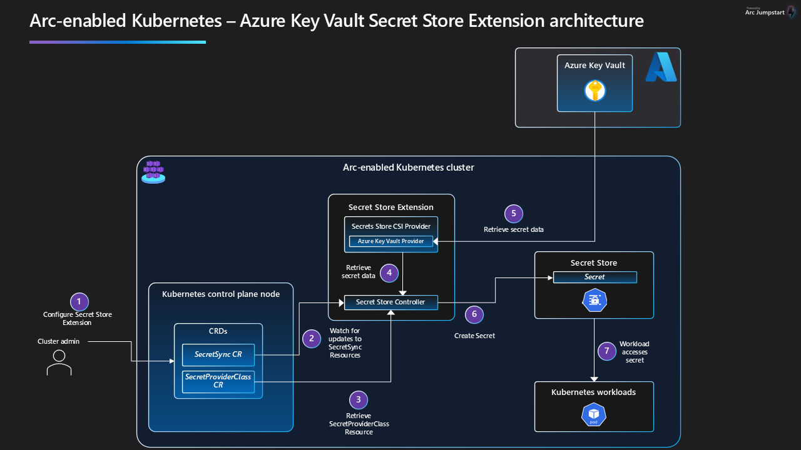
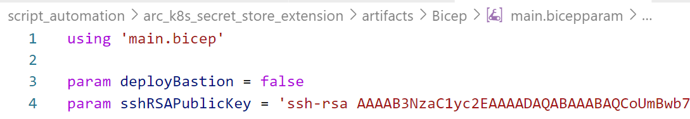
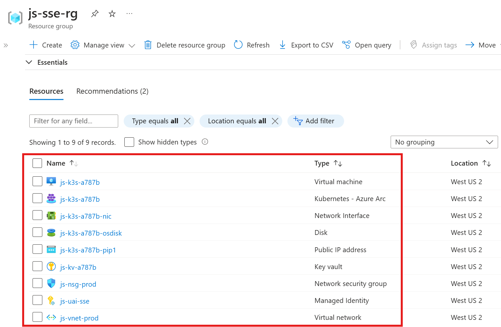
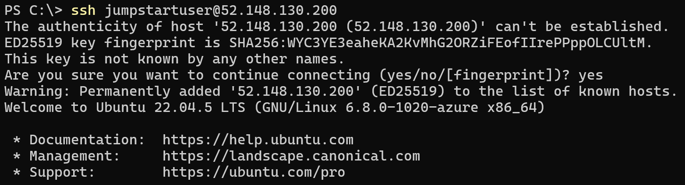
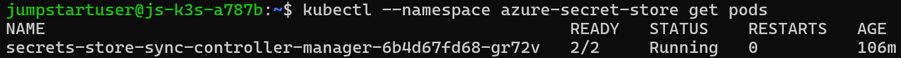
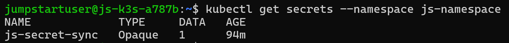
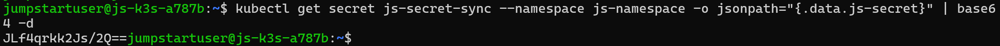
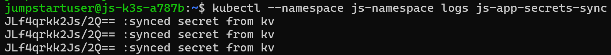
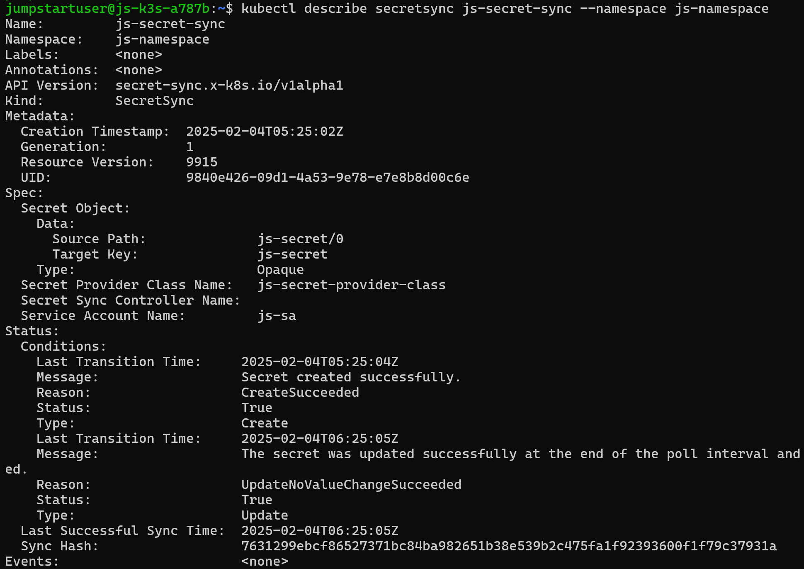

## Overview

#### Using Secret Store extension to fetch secrets in Azure Arc-enabled Kubernetes cluster
This Jumpstart drop provides comprehensive automation to set up a lightweight Kubernetes (K3s) cluster, connect it to Azure Arc and configure the Azure Key Vault Secret Store Extension. Secret Store extension synchronizes secrets from Azure Key Vault to your Kubernetes cluster. The automation script handles the installation of all necessary dependencies and deploys a sample application that demonstrates the use of the synchronized secrets within the Kubernetes environment. This setup ensures that your Kubernetes applications can securely access secrets stored in Azure Key Vault, even when operating offline.

> ⚠️ **Disclaimer:** Secret Store Extension is currently in public preview. For further details and updates on availability, please refer to the [Secret Store extension Documentation](https://learn.microsoft.com/en-us/azure/azure-arc/kubernetes/secret-store-extension).

## Architecture


## Prerequisites
- Clone the Azure Arc Drops repository

    ```shell
    git clone https://github.com/Azure/arc_jumpstart_drops.git
    ```

- [Install or update Azure CLI to version 2.53.0 and above](https://learn.microsoft.com/cli/azure/install-azure-cli?view=azure-cli-latest). Use the below command to check your current installed version.

  ```shell
  az --version
  ```

- Register necessary Azure resource providers by running the following commands.

  ```shell
  az provider register --namespace Microsoft.Kubernetes --wait
  az provider register --namespace Microsoft.KubernetesConfiguration --wait
  az provider register --namespace Microsoft.ExtendedLocation --wait
  ```

- [Generate a new SSH key pair](https://learn.microsoft.com/azure/virtual-machines/linux/create-ssh-keys-detailed) or use an existing one (Windows 10 and above now comes with a built-in ssh client). The SSH key is used to configure secure access to the Linux virtual machines that are used to run the Kubernetes clusters.

  ```shell
  ssh-keygen -t rsa -b 4096
  ```

  To retrieve the SSH public key after it's been created, depending on your environment, use one of the below methods:
  - In Linux, use the `cat ~/.ssh/id_rsa.pub` command.
  - In Windows (CMD/PowerShell), use the SSH public key file that by default, is located in the _`C:\Users\WINUSER/.ssh/id_rsa.pub`_ folder.

  SSH public key example output:

  ```shell
  ssh-rsa o1djFhyNe5NxxxxxxxxxxxxxxxxxxxxxxxxxxxxxxxxxxxxxxxxxxxxxxxxxxxxxxxxaDU6LwM/BTO1c= user@pc
  ```

- Edit the [main.bicepparam](https://github.com/microsoft/azure_arc/blob/main/azure_jumpstart_arcbox/bicep/main.bicepparam) template parameters file and supply values for your environment.
  - _`sshRSAPublicKey`_ - Your SSH public key
  - _`bastion`_ - Set to _`true`_ if you want to use Azure Bastion to connect to _js-k3s_



## Getting Started

### Run the automation

Navigate to the [deployment folder](https://raw.githubusercontent.com/Azure/arc_jumpstart_drops/sse/script_automation/arc_k8s_secret_store_extension/artifacts/Bicep/) and run the below command:

```shell
az login
az group create --name "<resource-group-name>"  --location "<preferred-location>"
az deployment group create -g "<resource-group-name>" -f "main.bicep" -p "main.bicepparam"
```

### Verify the deployment

- Once your deployment is complete, you can open the Azure portal and see the resources inside your resource group. You will be using the _js-k3s-*_ Azure virtual machine to review the secret store extension automation. You will need to remotely access _js-k3s-*_.

  

   > **Note:** For enhanced security posture, SSH (22) ports aren't open by default. You will need to create a network security group (NSG) rule to allow network access to port 22, or use [Azure Bastion](https://learn.microsoft.com/azure/bastion/bastion-overview) access to connect to the VM.

- SSH to the js-k3s virtual machine.
  ```shell
    ssh jumpstartuser@js-k3s-*
  ```
  

- SSE uses [cert-manager](cert-manager.io) to support TLS for intracluster log communication.
  ```shell
    kubectl --namespace cert-manager get pods
  ```
  

- SSE deployment contains a pod with two containers: the controller, which manages storing secrets in the cluster, and the provider, which manages access to, and pulling secrets from, the Azure Key Vault.
  ```shell
    kubectl --namespace azure-secret-store get pods
  ```
  

- View the secret synchronized to the k3s cluster.
  ```shell
    kubectl get secrets --namespace js-namespace
  ```
  

- Run below command to validate the synchronized secret values, stored in the Kubernetes secret store. You can also validate the value from the Key Vault deployed in the resource group.
  ```shell
    kubectl get secret js-secret-sync --namespace js-namespace -o jsonpath="{.data.js-secret}" | base64 -d
  ```
  

- Check deployed application logs to see the synced secret value.
  ```shell
    kubectl --namespace js-namespace logs js-app-secrets-sync
  ```
  

- Run describe command to get detailed status messages for each synchronization event. This can be used to diagnose connection or configuration errors, and to observe when the secret value changes.
  ```shell
    kubectl describe secretsync js-secret-sync --namespace js-namespace
  ```
  

### Resources

For more information, visit [Secret Store extension (preview)](https://learn.microsoft.com/en-us/azure/azure-arc/kubernetes/secret-store-extension).

To troubleshoot provider issue, visit [Secret Store extension troubleshooting](https://learn.microsoft.com/en-us/azure/azure-arc/kubernetes/secret-store-extension#troubleshooting)
