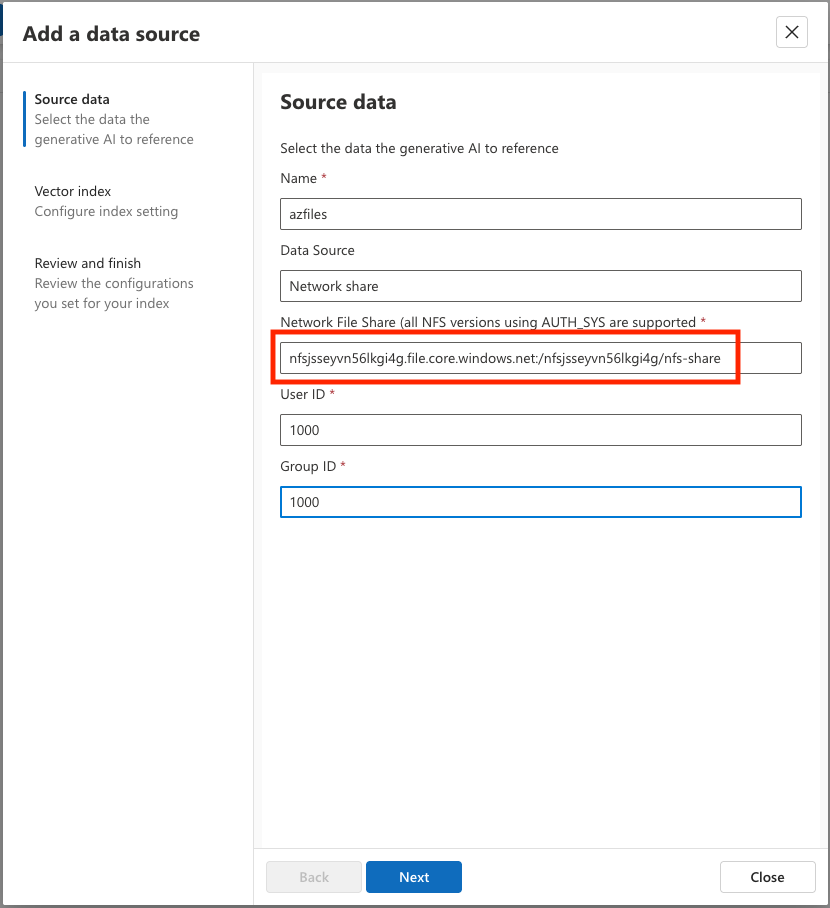

## Overview

#### Getting Started with Edge RAG enabled by Azure Arc

This Jumpstart Drop shows how to create an Azure Kubernetes Service (AKS) cluster to deploy Edge RAG enabled by Azure Arc. In the real world you would deploy this at the edge or on-premise, but we'll use Azure to deploy the Kubernetes cluster.

> ⚠️ **Disclaimer:** Edge RAG enabled by Azure Arc is currently in public preview. For further details and updates on availability, please refer to the [Edge RAG documentation](https://learn.microsoft.com/azure/azure-arc/edge-rag/overview).

## Prerequisites

- Clone the Azure Arc Drops repository

    ```shell
    git clone https://github.com/Azure/arc_jumpstart_drops.git
    ```

- [Install or update Azure CLI to version 2.53.0 and above](https://learn.microsoft.com/cli/azure/install-azure-cli?view=azure-cli-latest). Use the below command to check your current installed version.

  ```shell
  az --version
  ```

- have [kubectl](https://kubernetes.io/docs/tasks/tools/install-kubectl-windows/) installed

- the ability to either modify your hosts file locally or create a DNS A-record as described in the [Configure DNS](https://learn.microsoft.com/azure/azure-arc/edge-rag/prepare-dns) section of the documentation.

## Getting Started

The automation performs the following steps:

- Deploys an AKS cluster that meets the basic requirements for an Edge RAG cluster
- Creates an Azure Storage account and NFS share
- Configures the virtual networking such that the AKS cluster can reach the NFS share

### Run the automation

Create a resource group and deploy the Bicep template with the following commands:

```
az group create --name <Name of the Azure resource group> --location <Azure region>
az deployment group create \
--resource-group <Name of the Azure resource group> \
--template-file main.bicep \
--parameters main.parameters.json
```

### Run the post-automation steps

After running the automation, there are still some steps that need to occur manually to:

- upload sample PDFs to the NFS share.  This is necessary to load the NFS share with some data; however, you're free to load your own data
- deploy Cert-Manager and Trust-Manager to the AKS cluster, which are prerequisites for the Edge RAG extension
- deploy the Edge RAG extension itself
- add the NFS share to Edge RAG.  This is necessary so the extension can access sample content

#### Get AKS cluster credentials

In order to interact with the cluster and deploy the necessary components, you'll need to get credentials for the AKS cluster.  Do that with the following command:

`az aks get-credentials -n edgerag-cluster -g <your resource group name>`

#### Upload sample PDFs

Inside the repo, there is a Kubernetes manifest, **load-pdfs.yaml**, that will run a Kubernetes job that creates a pod, download two sample PDFs, and upload it to the NFS share.  Because the NFS share can only be accessed from a source in a specific virtual network, uploading the sample from a pod running on the cluster allows this to be done.  Before running this job, replace your storage account name with the placeholder on line 46.  You can obtain the storage account name from viewing it the Portal or by running `az deployment group show -g mirhoads-edgerag-drop-rg -n main --query "properties.outputs.storageAccountName.value"`


Next, run `kubectl apply -f load-pdfs.yaml`.  This will create the pod, mounts the NFS share, and downloads the PDF to the share.

> **Note** if you want to load your own content, you'll need to manage access to the NFS share itself as described [in the documentation on Azure Storage NFS shares](https://learn.microsoft.com/azure/storage/files/storage-files-how-to-mount-nfs-shares?tabs=Ubuntu)

#### Connect the AKS cluster to Azure Arc

Because this Drop simulates a local Kubernetes cluster, you'll next onboard the AKS cluster to Azure Arc.  Do so with the following command:

> ⚠️ **Important:** Edge RAG enabled by Azure Arc is currently supported in the regions listed in the [Edge RAG documentation](https://learn.microsoft.com/azure/azure-arc/edge-rag/requirements#supported-regions).  Ensure you run the command to Arc-enable the cluster in a supported region.

`az connectedk8s connect --name "edgerag-arc" --resource-group "<your resource group name" --location "eastus2"`

#### Install cert-manager and trust-manager

Before installing the Edge RAG extension itself, cert-manager and trust-manager need to be installed on the cluster, which can be done using a cluster extension with the following command:

`az k8s-extension create -g <your resource group name> -c "edgerag-arc" -t connectedClusters --scope cluster --name "cert-manager" --release-namespace "cert-manager" --release-train preview --extension-type "Microsoft.iotoperations.platform"`

#### Deploy the Edge RAG extension

Populate the variables in the table below in your terminal prior to deploying the Edge RAG extension.

  | Name                | Type     | Description                                                                                                           | Default |
  |---------------------|----------|-----------------------------------------------------------------------------------------------------------------------|---------|
  | _`gpu_enabled`_          | boolean  | Whether or not your cluster has GPUs available                                                                           |  false       |
  | _`edgeragdrop`_      | string  | The name of the Edge RAG Extension                                                                                |         |
  | _`autoUpgrade`_          | boolean  | Whether or not the extension will be auto-upgraded                                                                                      | false        |
  | _`domainName`_          | string  | The domain name used to access the Edge RAG UI                                                                                                  |         |
  | _`rg`_ | string  | The resource group name where your Arc-enabled Kubernetes cluster is                                                                              |         |
  | _`k8scluster`_ | string  | The name of the Arc-enabled Kubernetes cluster |         |
  | _`extension`_        | string | The name of the Edge RAG Extension                     |       |
  | _`modelName`_      | string  | the name of the model to use.  Choose either microsoft/Phi-3.5 or mistralAI/Mistral-7B                                                                                               |  microsoft/Phi-3.5       |
  | _`tenantId`_  | string  | The tenant ID for the app registration if you decide to use authentication.  Note that a value is still needed even if authentication is not used                                                                 |         |
  | _`appId`_  | string  | The app ID from the app registration if you decide to use authentication.  Note that a value is still needed even if authentication is not used                                                                 |         |

```
export gpu_enabled="false"  # Mark it true if you have GPUs available for Edge RAG
export localextname="edgeragdrop" 
export autoUpgrade="false"
export domainName="<the domain name to access the UI, such as edgerag.contoso.com>"
export rg="<your resource group name>"
export k8scluster="your Arc-enabled Kubernetes cluster name"
export extension="microsoft.arc.rag"
export modelName="microsoft/Phi-3.5"
export tenantId="00000000-0000-0000-0000-000000000000"
export appId="00000000-0000-0000-0000-000000000000" 
```

Finally, deploy the Edge RAG extension with the following command.  Note that this can take 5-15 minutes to complete.

`az k8s-extension create --cluster-type connectedClusters --cluster-name $k8scluster --resource-group $rg --name $localextname --extension-type $extension --release-train preview --auto-upgrade $autoUpgrade --configuration-settings isManagedIdentityRequired=true --configuration-settings gpu_enabled=$gpu_enabled --configuration-settings AgentOperationTimeoutInMinutes=30 --configuration-settings model=$modelName --configuration-settings ingress.domainname=$domainName --configuration-settings auth.featureEnable=false --configuration-settings auth.tenantId=$tenantId --configuration-settings auth.clientId=$appId`

### Configure Edge RAG in the Developer Portal

Now that the Edge RAG extension is deployed to the cluster, it's time to access it. Since this Drop is simulating what you'd do on a local cluster, there's some extra work required to access the cluster.  On the AKS cluster, a service of type LoadBalancer has been created within the arc-rag namespace.  In addition, an nginx ingress has been created with the domain you specified previously.  In order to access the Developer Portal for Edge RAG, you'll either need to create a hosts file record on your local computer or be able to set an A-record so that DNS resolves the domain name you specified to the cluster's load balancer.

To get the public IP address of the NGINX ingress controller running in the AKS cluster, run `kubectl get svc ingress-nginx-controller -n arc-rag -o jsonpath='{.status.loadBalancer.ingress[0].ip}'`


With the public IP address (172.168.80.30 from the image above), you'll need to either create an A record or modify your hosts file that points this IP address to the domainName you specified earlier.

#### Access the Developer Portal

In your browser, go to the domain name you specified.  For the sake of simplicity for this Drop, a self-signed certificate is used.  Because of that, you'll need to trust the self-signed certificate.  In production, you should use a certificate issued by a Certificate Authority.


#### Add NFS Share to Developer Portal

First, you'll need to add the data source.  This will be the NFS share that you previously loaded with sample PDFs.  To get the NFS share, run the following CLI command: `az deployment group show -g <your resource group name> -n main --query "properties.outputs.nfsShareMountPath.value"`


In the **Add a data source** populate the dialogue with your NFS share.  Unless you're using your own NFS share or have a reason to use a different user ID and group ID, you can enter 1000 for both.



Next, you can choose to schedule updates to the index or not.  If you plan to add additional files, choose to schedule updates either every 1 hour, 4 hours, or 24 hours.  If desired, set the chunk size and chunk overlap.  Wait until the status of the data source is complete.


#### Test chat in the Developer Portal

Next, go to the chat section of the Developer Portal.  The PDFs that were previously uploaded pertain to employee benefits provided by a fictional company, Contoso Electronics.  Experiment with different prompts, such as:

- "summarize the PerksPlus plan offered by my employer"
- "are immunizations covered by my health plan?"
- "for a family, what is the annual deductible of this plan?"


At this point, you can experiment with other prompts and/or load custom data to the NFS share.
