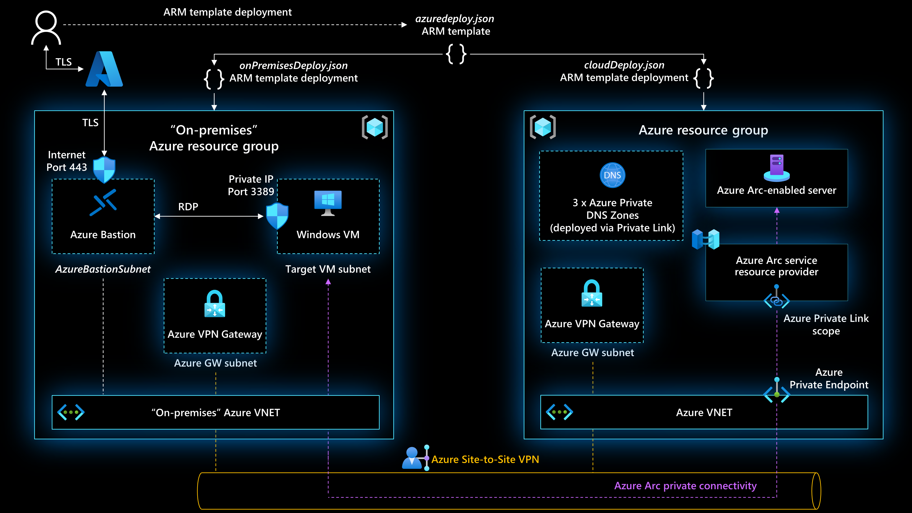
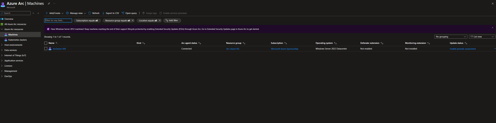
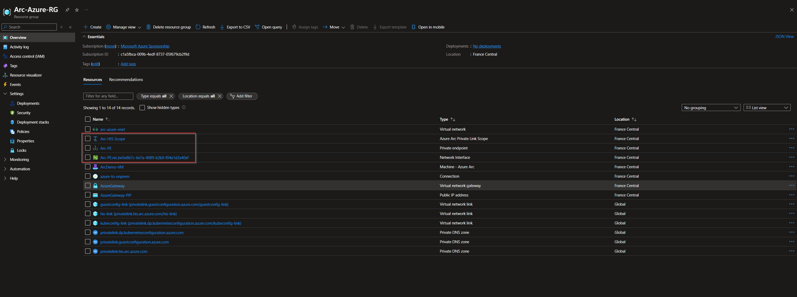

# Azure Arc with Private Link (Terraform)

This Terraform configuration deploys a full Azure Arc-enabled infrastructure scenario using **Azure Virtual Network Gateway connections** between simulated **on-premises** and **Azure** environments. It includes support for **Azure Arc Private Link**, **Windows VM onboarding**, and **secure remote access via Azure Bastion**.

> ℹ️ This project is based on the community work from [Azure Arc Jumpstart](https://github.com/microsoft/azure_arc).  


## 📌 Features

- Dual virtual network setup (on-prem & Azure)
- VNet-to-VNet VPN gateway connections
- Azure Arc Private Link Scope & Private Endpoint
- Windows Server VM onboarding to Azure Arc
- Custom Script Extension for automatic registration
- Azure Bastion host for RDP access
- Private DNS zone configuration
- Network security rules




## ✅ Prerequisites

- Azure CLI
- Terraform installed locally
- A **Service Principal** with `Contributor` role on a **subscription**
- [Terraform CLI](https://developer.hashicorp.com/terraform/downloads)
- Azure Subscription
- [Azure CLI](https://learn.microsoft.com/en-us/cli/azure/install-azure-cli)
- An Azure AD App registration with:
  - `Client ID`
  - `Client Secret`
  - `Tenant ID`
  - `Subscription ID`
  - `admin_username`
  - `admin_password`

### Quick SPN creation:

```
az login
subscriptionId=$(az account show --query id --output tsv)
az ad sp create-for-rbac -n "JumpstartArc" --role "Contributor" --scopes /subscriptions/$subscriptionId
```
## 🚀 Deployment with Terraform

Run the Terraform script by providing the following input variables:

- `client_id`
- `client_secret`
- `tenant_id`
- `subscription_id`
- `admin_username`
- `admin_password`
These identifiers are linked to the Main Service created earlier.

## 🧪 Test Result

Once the deployment and configuration are complete:

- ✅ The **Azure Arc** resource is successfully onboarded  



- ✅ The **Azure Arc PrivateLink** is in place 


🧹 Cleanup / Destruction

When using `terraform destroy`, you may encounter issues related to the Azure Arc onboarding process:

1. ❗ **Hybrid Machine resource not deleted**
   - Even after destroying the VM, the associated `Microsoft.HybridCompute/machines/<vm-name>` resource may still exist.
   - This resource must be deleted manually via Azure CLI:

     ```bash
     az resource delete \
       --ids "/subscriptions/<your-subscription-id>/resourceGroups/Arc-Azure-RG/providers/Microsoft.HybridCompute/machines/<vm-name>"
     ```

2. ❗ **Manual deletion of resource groups may be required**
   - In some cases, Terraform may be unable to delete the resource group due to lingering Arc-related resources (e.g., extensions, hybrid compute registrations).
   - You can manually delete the resource groups from the [Azure Portal](https://portal.azure.com) or use the CLI:

     ```bash
     az group delete --name Arc-Azure-RG --yes --no-wait
     az group delete --name Arc-OnPrem-RG --yes --no-wait
     ```

🔐 Use this option with caution, especially in production environments.

