## Rough Draft

- show CloudFormation template for onboarding
- highlight resources other than EC2 instances (e.g. S3 buckets, databases, etc.)
- KQL queries to show AWS resources
- show onboarding EC2 instances
- KQL queries for EC2 instances (e.g. OS details to show all Ubuntu 22.04, etc.)
- show periodic sync by adding a resource in AWS after setting up the connector

## Questions for Lior

- [ ] do we want this to just be for Drops or include scenarios too?  one drop for Multicloud Inventory and one for Onboarding VMs?
- [ ] any specific ties to other components you want highlighted, like AMA? Defender.
- [ ] ~3 EC2 instances good enough to show the solution while staying under budget?

## Overview

The following Jumpstart Drop will guide you through using the multicloud connector enabled by Azure Arc.  It will show how to onboard EC2 instances from Amazon Web Services (AWS) as well as view an inventory of AWS resources within Azure.

## Prerequisites

Note that to complete this Drop, you will need permissions both in AWS as well as in Azure.  

### AWS Prerequisites

In AWS, you'll need the following permissions:
- AmazonS3FullAccess
- AWSCloudFormationFullAccess
- IAMFullAccess
- Global Read (for the Inventory solution)
- AmazonEC2FullAccess (for the Arc Onboarding solution)
- EC2 Write (for the Arc Onboarding solution)

For the Arc Onboarding solution, the EC2 instances must also:
- satisfy the [prerequisites for the Connected Machine agent](https://learn.microsoft.com/en-us/azure/azure-arc/servers/prerequisites).
- have the SSM agent installed
- be tagged with a key of *arc* and any value.  Without this tag, the EC2 instances will not be onboarded.
- have the ArcForServerSSMRole IAM role [attached](https://docs.aws.amazon.com/AWSEC2/latest/UserGuide/iam-roles-for-amazon-ec2.html#attach-iam-role).

### Azure Prerequisites

The following resource providers must be [registered](https://learn.microsoft.com/en-us/azure/azure-resource-manager/management/resource-providers-and-types#register-resource-provider):
- Microsoft.HybridCompute
- Microsoft.HybridConnectivity
- Microsoft.AwsConnector

## Getting Started

You'll first deploy the AWS connector in Azure.  After doing so, you'll then deploy a CloudFormation template in AWS.

### Deploying AWS connector in Azure

You'll use the Azure portal to generate the CloudFormation template.  

1. In the Azure portal, navigate to Azure Arc.
2. Under Management, select Multicloud connectors (preview).
3. In the Connectors pane, select Create.
4. On the Basics page:

    a. Select the subscription and resource group in which to create your connector resource.

    b. Enter a unique name for the connector and select a supported [region](https://learn.microsoft.com/en-us/azure/azure-arc/multicloud-connector/overview#supported-regions).

    c. Provide the ID for the AWS account that you want to connect, and indicate whether it's a single account or an organization account.

    d. Select **Next**.

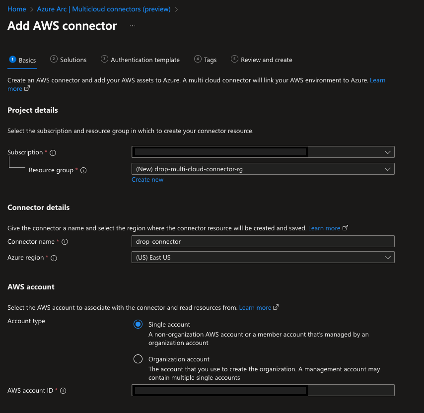

5. On the **Solutions** page, click the **Add** button for Inventory

You'll next need to specify the settings to the Inventory solution.  By default, all available AWS services and all AWS regions are selected. In addition, period sync is enabled by default with a one hour sync period.  Change these settings if desired.

6. Click **save**

7. On the **Solutions** page, click the **Add** button for Arc onboarding

8. If needed, change the settings in the Arc onboarding settings screen (e.g. connectivity method, resource filters, etc.).

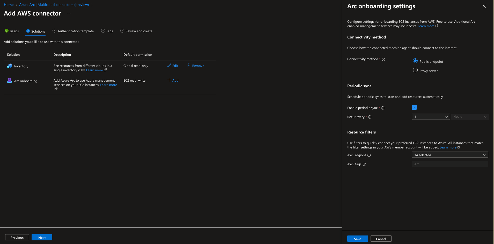

9. Click **save**

10. With both solutions added to the **Add AWS connector** screen, click **Next**

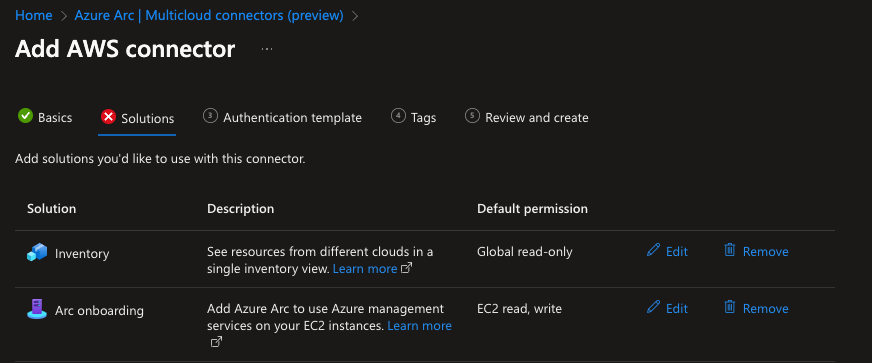

11. Download the AWS CloudFormation template generated in the Portal

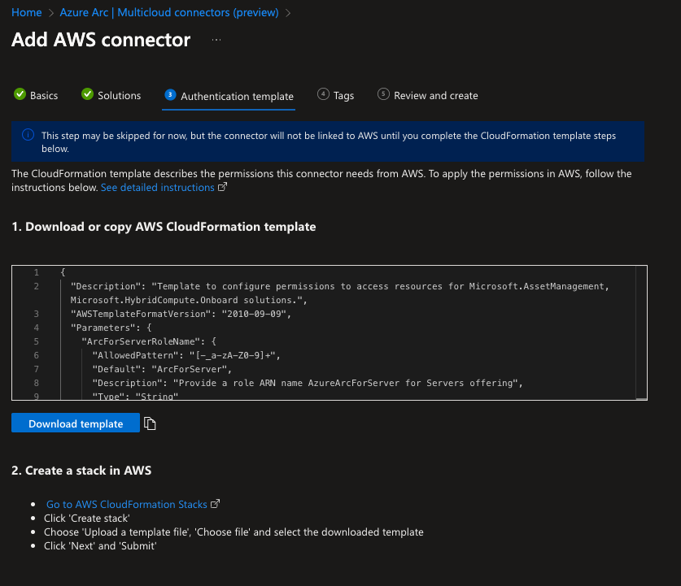

12. Click **Next**

13. Add any tags, if desired

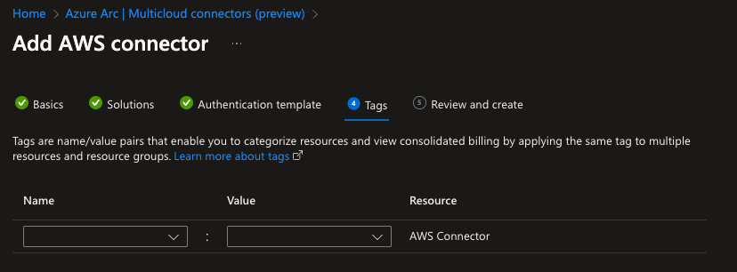

14. Click **Next**

15. On the Review and create screen, verify that the settings you specify are correct and click **Create**

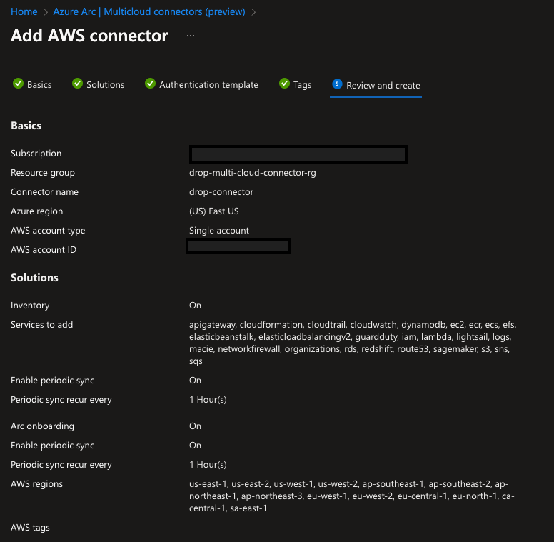

16. Click **Create**

At this point, the Multicloud connector resource is created in Azure but now you need to upload the generated CloudFormation template in AWS.

### Upload CloudFormation template to AWS

In this section, you'll complete these steps in AWS.

> the steps below assume you're deploying this to a single account in AWS.  If deploying to an organizational account, you'll need to follow the [documentation](https://learn.microsoft.com/en-us/azure/azure-arc/multicloud-connector/connect-to-aws#create-stackset) to create a StackSet after completing the steps below.

1. In the AWS console, navigate to the CloudFormation service and click on Create stack

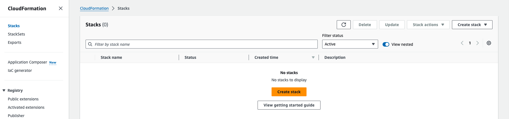

2. In the specify a template section, click **Upload a template file** and upload the JSON file you downloaded in Step 11 of the previous section

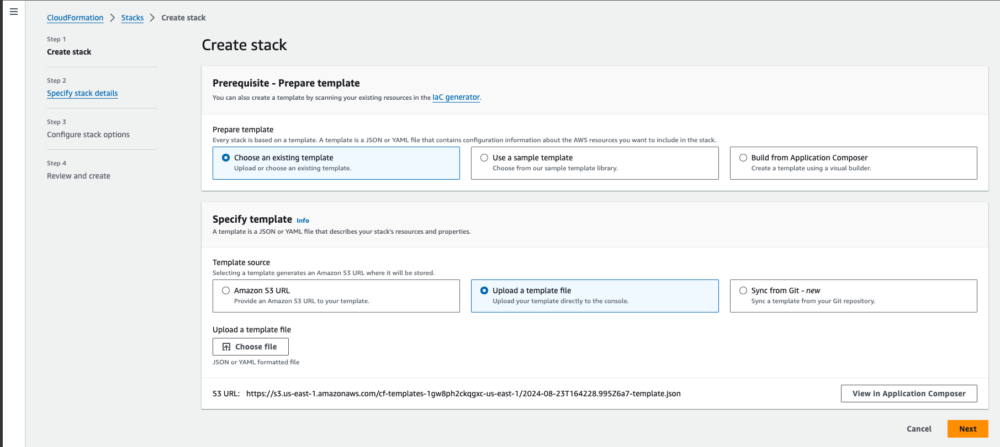

3. Provide a name for the stack and leave the other parameters as-is

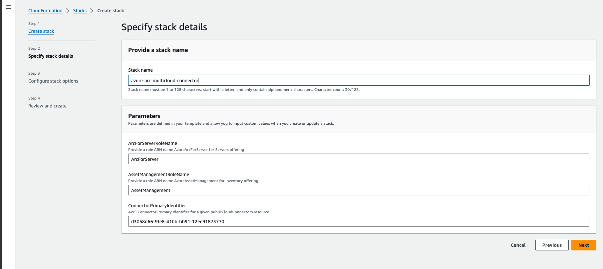

4. Leave the options on the **Configure stack options** screen as-is and select **Next**

5. On the **Review and create** page, review the information on the screen and select the acknowledgement checkbox and click **Submit**

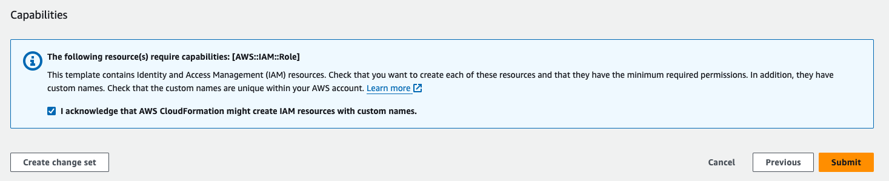

> If using an organization account, you'll also need to create a StackSet as described [here](https://learn.microsoft.com/en-us/azure/azure-arc/multicloud-connector/connect-to-aws#create-stackset)

After the CloudFormation template is deployed, it takes approximately one hour for AWS resources to appear in Azure.

## Onboarding EC2 Instances to Azure Arc

In order for EC2 instances to be onboarded to Azure Arc, the EC2 instances must have a tag with a key of **arc** (with any value) and have the ArcForServerSSMRole IAM role assigned.

In the screenshot below, the tag of **arc** is sufficient to have this instance onboarded to Azure Arc.

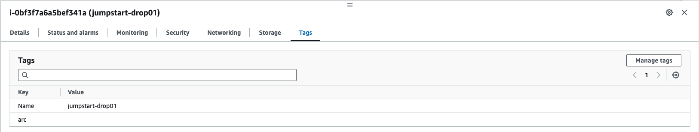

In addition, the next screenshot shows the ArcForServerSSMRole successfully attached to this instance.  Refer to [this](https://docs.aws.amazon.com/AWSEC2/latest/UserGuide/iam-roles-for-amazon-ec2.html#attach-iam-role) documentaion for attaching this role to the EC2 instance(s). 

## Resources