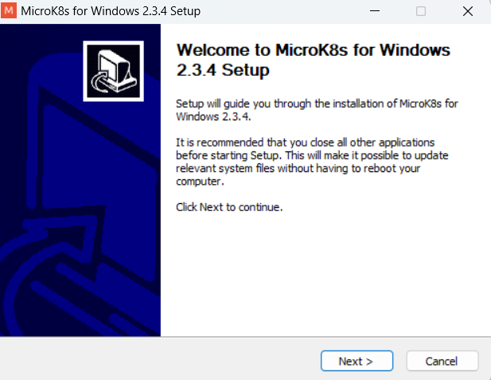
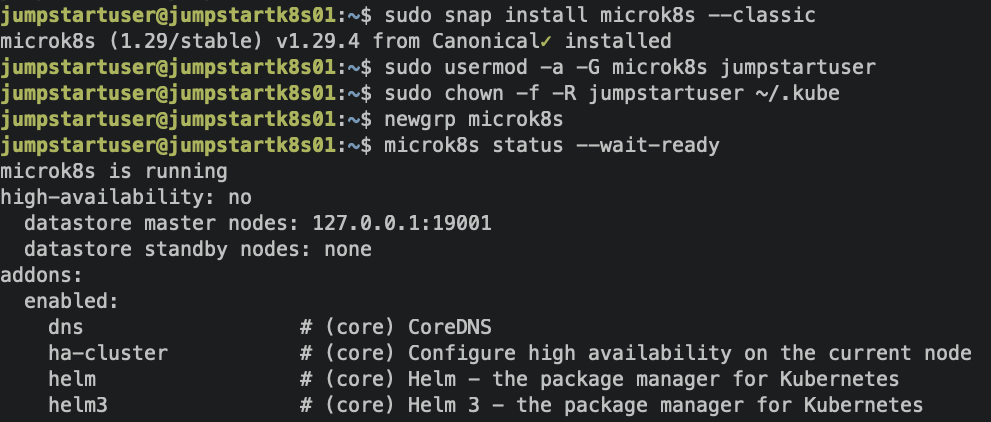
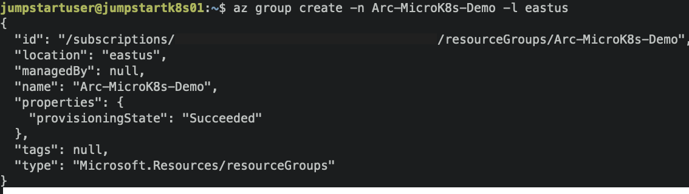
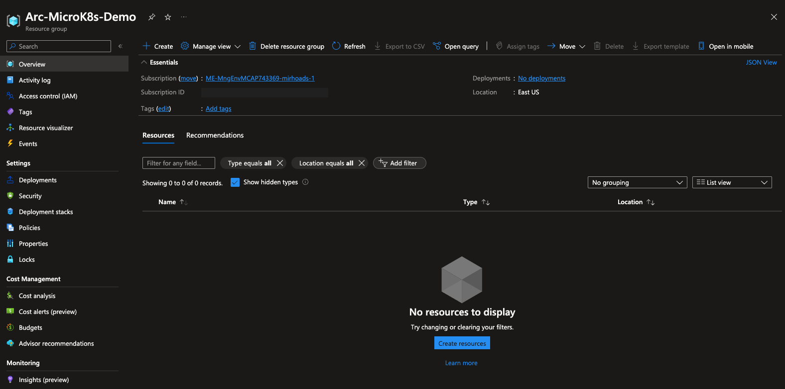
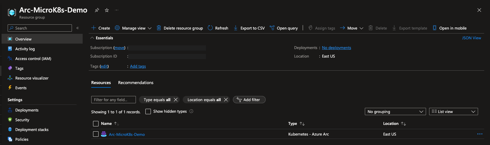
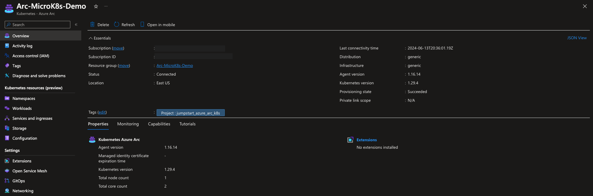
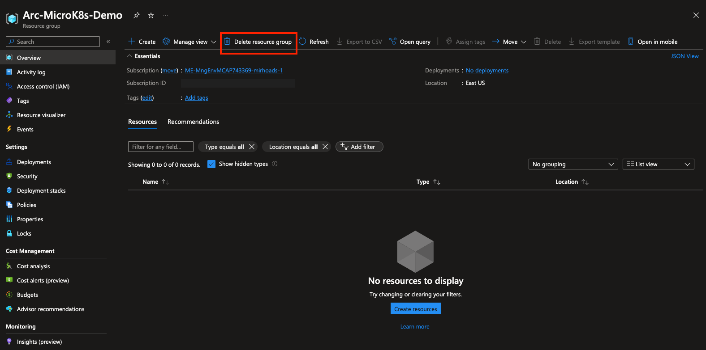
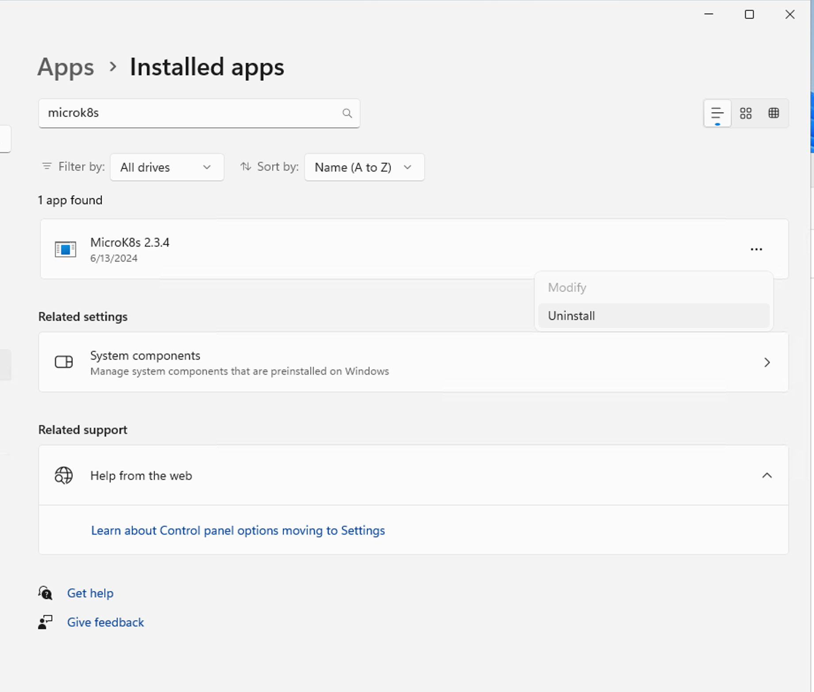
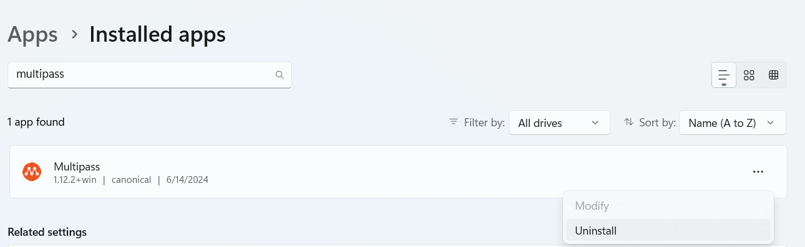

## Overview

This Jumpstart Drop will guide you through creating a Kubernetes cluster using MicroK8s and onboarding it as an Azure Arc-enabled Kubernetes cluster.

## Prerequisites

- [Install or update the latest Azure CLI ](https://learn.microsoft.com/cli/azure/install-azure-cli?view=azure-cli-latest). Use the below command to check your current installed version.

  ```shell
  az --version
  ```

- [Enable subscription with](https://learn.microsoft.com/azure/azure-resource-manager/management/resource-providers-and-types#register-resource-provider) the three resource providers for Azure Arc-enabled Kubernetes. Registration is an asynchronous process, and registration may take approximately 10 minutes.

  ```shell
  az provider register --namespace Microsoft.Kubernetes
  az provider register --namespace Microsoft.KubernetesConfiguration
  az provider register --namespace Microsoft.ExtendedLocation
  ```

  You can monitor the registration process with the following commands:

  ```shell
  az provider show -n Microsoft.Kubernetes -o table
  az provider show -n Microsoft.KubernetesConfiguration -o table
  az provider show -n Microsoft.ExtendedLocation -o table
  ```

- Install the Azure Arc for Kubernetes CLI extension ***connectedk8s***:

  ```shell
  az extension add --name connectedk8s
  ```

  > **Note:** If you already used this guide before and/or have the extension installed, use the below commands.

  ```shell
  az extension update --name connectedk8s
  ```

## Getting Started

### Install Microk8s

- Install MicroK8s following the [specific install guide](https://microk8s.io/) for your operating system. For convenience, we've added some commands below:

  Windows:
  
    Download the [MicroK8s installer for Windows](https://microk8s.io/docs/install-windows) and follow the instructions.

    

    Once installed, enable MicroK8s with:

    ```shell
    microk8s status --wait-ready
    ```

  Linux:

    ```shell
    sudo snap install microk8s --classic
    sudo usermod -a -G microk8s <username>
    sudo chown -f -R <username> ~/.kube
    newgrp microk8s
    microk8s status --wait-ready
    ```

    

  MacOS:

    ```shell
    brew install ubuntu/microk8s/microk8s
    microk8s install
    microk8s status --wait-ready
    ```

    

  WSL2:

  [Refer to the MicroK8s guide](https://microk8s.io/docs/install-wsl2)) to install MicroK8s in Windows Subsystem for Linux (WSL) 2.

### Connect the cluster to Azure Arc

- from the Azure CLI, create a resource group

  ```shell
  az group create -n Arc-MicroK8s-Demo -l EastUS
  ```

  

  

- Connect the cluster to Azure Arc

  Windows:

  ```shell
  az connectedk8s connect --name Arc-MicroK8s-Demo --resource-group Arc-MicroK8s-Demo --kube-config %HOMEPATH%\.kube\microk8s --kube-context microk8s --tags 'Project=jumpstart_azure_arc_k8s' --correlation-id "d009f5dd-dba8-4ac7-bac9-b54ef3a6671a"
  ```

  Linux and MacOS:

  ```shell
  az connectedk8s connect --name Arc-MicroK8s-Demo --resource-group Arc-MicroK8s-Demo  --kube-config ~/.kube/microk8s --kube-context microk8s --tags 'Project=jumpstart_azure_arc_k8s' --correlation-id "d009f5dd-dba8-4ac7-bac9-b54ef3a6671a"
  ```

  

- Upon completion, you will have your MicroK8s cluster connected as a new Azure Arc Kubernetes cluster resource in a new resource group.

  

  

### Optional - Day 2 Operations

Now that your Kubernetes cluster is connected to Azure Arc, you might want to explore the following scenario:

- [Deploy GitOps configurations and perform Helm-based GitOps flow on MicroK8s as an Azure Arc Connected Cluster](https://arcjumpstart.com/azure_arc_jumpstart/azure_arc_k8s/day2/microk8s/local_microk8s_gitops_helm)

### Delete the deployment

- In Azure, the most straightforward way is to delete the cluster or the resource group via the Azure portal or through the CLI.

  ```shell
  az group delete --name Arc-MicroK8s-Demo
  ```

  

- To stop the MicroK8s cluster locally, use the following command:

  ```shell
  microk8s stop
  ```

- The uninstall process of MicroK8s depends on your operating system.

  Windows

    Stop the MicroK8s VM in Multipass:

    ```shell
    multipass stop microk8s-vm
    ```

    Launch `Add or Remove Programs` and uninstall MicroK8s.

    

    ```shell
    multipass delete microk8s-vm
    multipass purge
    ```

    If you want to completely uninstall Multipass, launch `Add or Remove Programs` and uninstall Multipass.

    

  Linux:

    ```shell
    sudo snap remove microk8s
    ```
  
  MacOS:

    ```shell
    brew uninstall ubuntu/microk8s/microk8s
    ```
    
## Resources

The [microk8s](https://microk8s.io/) site has [documentation](https://microk8s.io/docs) that addresses [installation](https://microk8s.io/docs/install-alternatives) as well as the use of [addons](https://microk8s.io/docs/addons) and creating a [multi-node cluster](https://microk8s.io/docs/clustering).