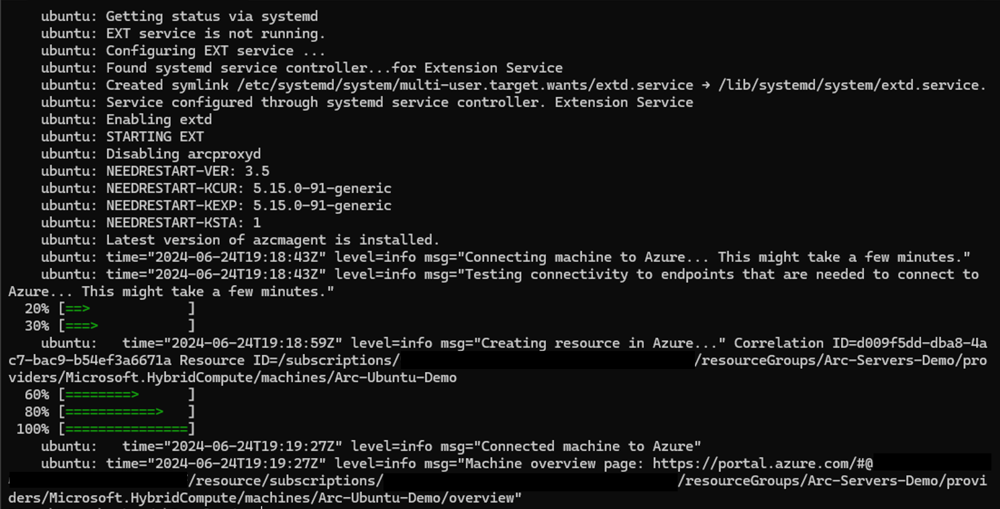
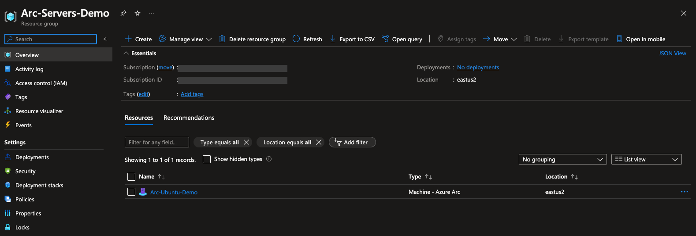
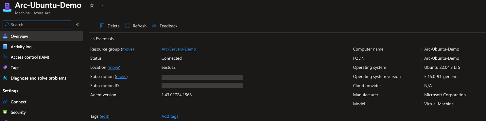
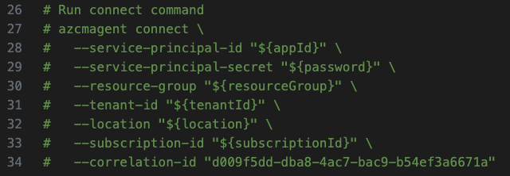
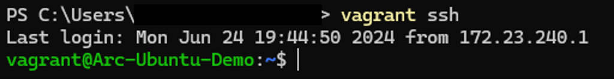
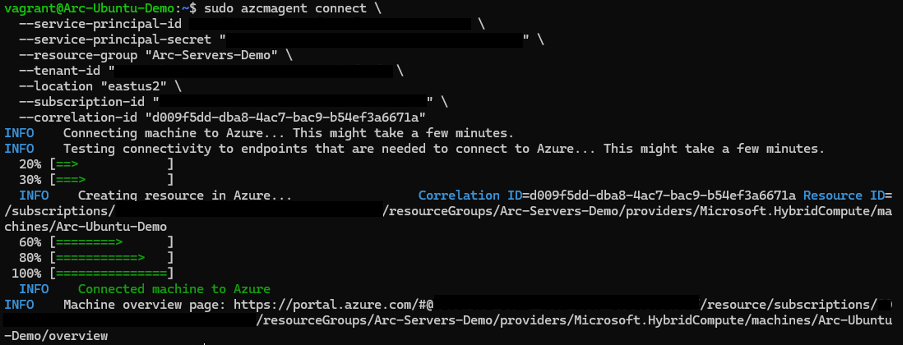
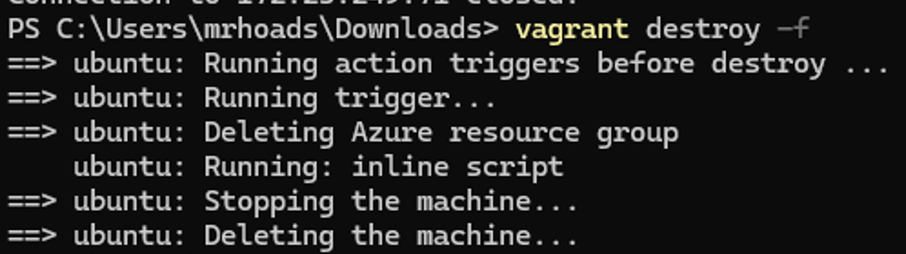

## Overview

This Drop will guide you through deploying a local Ubuntu 22.04 virtual machine using [Vagrant](https://www.vagrantup.com/) and connect it as an Azure Arc-enabled server resource.

## Prerequisites

- Vagrant relies on a provider to create machines, such as VirtualBox, VMware, and Hyper-V.  For the purpose of this guide, we'll be using Hyper-V; however, the steps in this Drop will work for any provider supported by the [generic/ubuntu2204 Vagrant box](https://app.vagrantup.com/generic/boxes/ubuntu2204)

  - To install Hyper-V on Windows, run `Enable-WindowsOptionalFeature -Online -FeatureName Microsoft-Hyper-V -All` from a PowerShell console as Administrator and then restart the computer.  If not using Windows, use your preferred [Provider](https://developer.hashicorp.com/vagrant/docs/providers)
  
- From Windows, install Vagrant with `winget install vagrant`

- [Install or update Azure CLI to the latest version](https://learn.microsoft.com/cli/azure/install-azure-cli?view=azure-cli-latest). Use the below command to check your current installed version.

- Create Azure service principal (SP)

    To connect the Vagrant virtual machine to Azure Arc, an Azure service principal assigned with the "Contributor" role is required. To create it, login to your Azure account run the below command (this can also be done in [Azure Cloud Shell](https://shell.azure.com/).

    ```shell
    az login
    subscriptionId=$(az account show --query id --output tsv)
    az ad sp create-for-rbac -n "<Unique SP Name>" --role "Contributor" --scopes /subscriptions/$subscriptionId
    ```

    For example:

    ```shell
    az login
    subscriptionId=$(az account show --query id --output tsv)
    az ad sp create-for-rbac -n "JumpstartArc" --role "Contributor" --scopes /subscriptions/$subscriptionId
    ```

    Output should look like this:

    ```json
    {
    "appId": "XXXXXXXXXXXXXXXXXXXXXXXXXXXX",
    "displayName": "JumpstartArc",
    "password": "XXXXXXXXXXXXXXXXXXXXXXXXXXXX",
    "tenant": "XXXXXXXXXXXXXXXXXXXXXXXXXXXX"
    }
    ```

    > **Note:** If you create multiple subsequent role assignments on the same service principal, your client secret (password) will be destroyed and recreated each time. Therefore, make sure you grab the correct password.

    > **Note:** The Jumpstart scenarios are designed with as much ease of use in-mind and adhering to security-related best practices whenever possible. It is optional but highly recommended to scope the service principal to a specific [Azure subscription and resource group](https://learn.microsoft.com/cli/azure/ad/sp?view=azure-cli-latest) as well considering using a [less privileged service principal account](https://learn.microsoft.com/azure/role-based-access-control/best-practices).

- Azure Arc-enabled servers depends on the following Azure resource providers in your subscription in order to use this service. Registration is an asynchronous process, and registration may take approximately 10 minutes.

  - Microsoft.HybridCompute
  - Microsoft.GuestConfiguration
  - Microsoft.HybridConnectivity

      ```shell
      az provider register --namespace 'Microsoft.HybridCompute'
      az provider register --namespace 'Microsoft.GuestConfiguration'
      az provider register --namespace 'Microsoft.HybridConnectivity'
      ```

      You can monitor the registration process with the following commands:

      ```shell
      az provider show --namespace 'Microsoft.HybridCompute'
      az provider show --namespace 'Microsoft.GuestConfiguration'
      az provider show --namespace 'Microsoft.HybridConnectivity'

- The Vagrantfile executes a script on the VM OS to install all the needed artifacts as well to inject environment variables. Edit *scripts/vars.sh* to match the Azure service principal you've just created, provide a name for the resource group that will get created, and specify the Azure region (e.g. "eastus2") where the Vagrant box should be onboarded to.

  - subscriptionId=Your Azure subscription ID
  - appId=Your Azure service principal name
  - password=Your Azure service principal password
  - tenantId=Your Azure tenant ID
  - resourceGroup=Azure resource group name
  - location=Azure region

## Getting Started

### Initialize Vagrant Box

From the location where you've downloaded the Drop and the Vagrantfile it contains, run `vagrant up`.  The first time you run this, the Vagrant box, which is approximately 1.7 GB will be downloaded to your local machine.  Subsequent deployments will faster, as the box is cached locally.

Once the box has been downloaded, there are three [provisioners](https://developer.hashicorp.com/vagrant/docs/provisioning) that will be run:

1. The first sets environment variables for your service principal, resource group, and location
2. The second block access to the Azure Instance Metadata Service (IMDS) using Ubuntu's Uncomplicated Firewall (UFW) so this Drop can, if desired, be run on an Azure VM
3. The third runs a Bash script to install and connect the machine to Azure Arc



### Verify Connected Machine in Azure Arc 

Upon completion, the Ubuntu VM will be connected to Azure Arc inside the newly-created resource group.  From here, you can experiment with other Drops  to try out Arc-enabled Server capabilities.





### Semi-Automated Deployment (Optional)

While the Vagrantfile can be use to automate the entire lifecycle of the VM creation and registration with Azure Arc, you can instead run the registration process yourself.  This is accomplished by doing the following:

- In the [*install_arc_agent*](https://github.com/microsoft/azure_arc/blob/main/azure_arc_servers_jumpstart/local/vagrant/ubuntu/scripts/install_arc_agent.sh) shell script, comment out the "Run connect command" section and save the file. You can also comment out or change the creation of the resource group.

    

- SSH the VM using the *`vagrant ssh`* command.

    

- Run the same *azcmagent connect* command you've just commented out using your environment variables.

    

### Delete the deployment

To delete the entire deployment, run the *`vagrant destroy -f`* command. The Vagrantfile includes a *before: destroy* Vagrant trigger which will run a script to delete the Azure resource group before destroying the actual VM. That way, you will can re-run the Vagranfile multiple times without issues.



## Resources

The following resources may be useful for this Drop:

- [Vagrant installation](https://developer.hashicorp.com/vagrant/docs/installation)
- [Vagrant note on Windows, Hyper-V, and VirtualBox](https://developer.hashicorp.com/vagrant/docs/installation#windows-virtualbox-and-hyper-v)
- [Arc-enabled Servers Overview](https://learn.microsoft.com/en-us/azure/azure-arc/servers/overview)