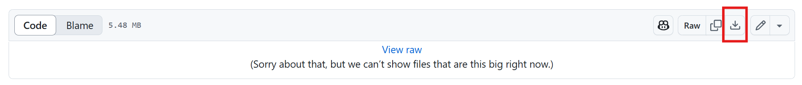
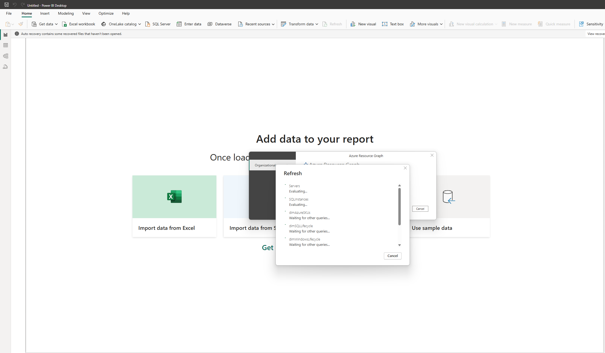
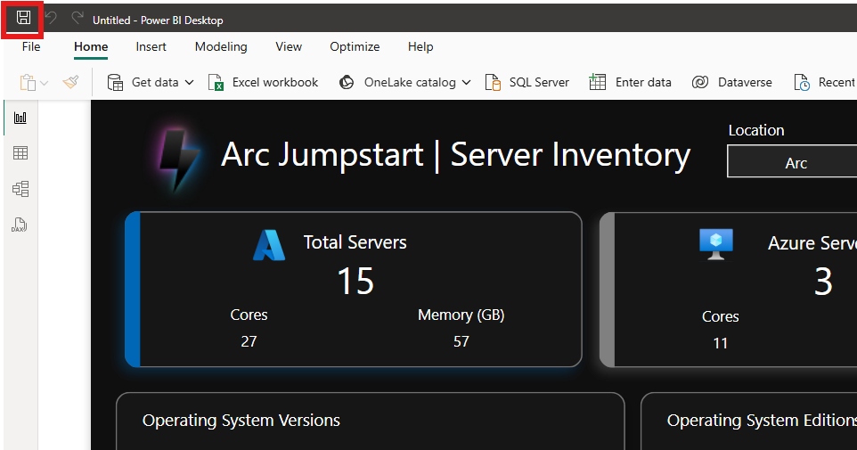

## Arc Insights PBI Dashboards Powered by Jumpstart

The Arc Insights Power BI (PBI) dashboards provides users with a single pane of glass insights and visualizations for your servers, enabled by Arc or as Azure virtual machines. The dashboard covers a range of scenarios including Server Inventory, SQL Instances on Virtual Machines, SQL Databases on virtual machines and Extended Security Update (ESU) cost forecasting. With the Arc Insights PBI Dashboards Powered by Jumpstart, you have a **rich set of Dashboards about your Arc connected estate, available in minutes, not weeks**, which can then be customized to suit your individual requirements.

Using Power BI over Azure out-of-the-box dashboards provides several benefits to users which include:

1. Power BI provides a platform to visualize and share your IT Infrastructure with users, without the need for Azure portal access.
2. Power BI has a rich programming language allowing for more advanced queries and joining of datasets that sit outside Azure.
3. Power BI has numerous visualization options to build feature-rich dashboards.

The Arc Insights Power BI Dashboards utilize the Power BI connector for Azure Resource Graph, which connects the dashboards to your Azure subscription(s), visualizing all your servers, whether Azure virtual machine or enabled by Azure Arc. Power BI offers a rich set of visualizations and query tools, enabling advanced scenarios such as **Extended Support Updates cost forecasting for SQL and Windows Server 2016. This insight helps you manage and prioritize your modernization projects effectively, helping to avoid the costs and risks associated with Extended Security Updates**.

The Arc Insights PBI dashboards contain:

* **Server Inventory** - A detailed inventory of all servers, both Azure and Arc-enabled, providing a clear overview of server landscape.
* **SQL Inventory** - Information on SQL instances, including both Azure SQL and SQL Servers enabled by Arc, ensuring you have a complete view of your SQL Server environment.
* **Databases** - Insights into databases managed through Azure Arc, helping you track and manage your database assets effectively.
* **ESU Forecast** - An estimate of future costs for Extended Security Updates (ESU) for Windows Server 2016 and SQL Server 2016, based on current pricing. For detailed prices of ESUs see: [Azure Arc pricing](https://azure.microsoft.com/pricing/details/azure-arc/core-control-plane/)

## Screenshots

Here are some screenshots of the Arc Insights PBI dashboards:

Screenshot showing Server Inventory:

Screenshot showing SQL Server Inventory:

Screenshot showing SQL Database Inventory:

Screenshot showing ESU Forecast:

## Prerequisites

* Azure subscription(s).
* Arc-enabled servers within your Azure subscription(s). The dashboards may encounter errors on refresh if subscriptions have no Arc connected resources.
* If you have SQL Server VMs that are Arc-enabled, these will require the [SQL Server Extension](https://learn.microsoft.com/sql/sql-server/azure-arc/connect?view=sql-server-ver16&tabs=windows) to be enabled.
* Azure credential with read access to Azure Resource Graph, to the Azure Subscription. To learn more about this see [Permissions in Azure Resource Graph](https://learn.microsoft.com/azure/governance/resource-graph/overview#permissions-in-azure-resource-graph).
* Internet connectivity.
* [Microsoft Power BI Desktop](https://www.microsoft.com/power-platform/products/power-bi/downloads?msockid=0c5db1779a21637012a6a5f29bea62ee).

## Getting Started

### How to install the Arc Insights PBI Dashboards

1. Download the Power BI template file: [Arc Insights PBI Dashboard](https://github.com/Azure/arc_jumpstart_drops/blob/main/ui_dashboard_workbook/arc_pbi_dashboard/arc_insights_dashboard_jumpstart.pbit)

2. Open the Power BI template File, upon first opening the dashboard will attempt refresh.

3. During the refresh, Power BI will prompt for credentials for "Azure Resource Graph" as shown below:

5. Sign in with a login that has "Read" access to Azure Resource Graph for the subscription(s) you want the report to view.

6. Click "Connect" each time you are prompted.

7. Save your new Power BI dashboard.

### Data Sources Used

The Dashboard has the following data sources:
1. Azure Resource Graph - Used to gather Servers, SQL Server VM Instances and SQL VM Databases across Azure and Arc-enabled. Kusto Query Language (KQL) queries are saved to: [Azure Resource Graph Queries](https://github.com/Azure/arc_jumpstart_drops/tree/main/ui_dashboard_workbook/arc_pbi_dashboard/artifacts/arg_queries)
2. [Learn.microsoft.com](https://learn.microsoft.com/) - Used to gather latest SQL Patch information
3. Reference CSVs - CSVs containing Azure SKUs and Product Lifecycle dates: [Reference CSVs](https://github.com/Azure/arc_jumpstart_drops/tree/main/ui_dashboard_workbook/arc_pbi_dashboard/artifacts/reference)

## Resources

For more information please review the following resources:

* [Azure Resource Graph](https://learn.microsoft.com/azure/governance/resource-graph/overview#permissions-in-azure-resource-graph)
* [Arc-enabled servers](https://learn.microsoft.com/azure/azure-arc/servers/overview)
* [Power BI Connector](https://learn.microsoft.com/azure/governance/resource-graph/power-bi-connector-quickstart?tabs=power-bi-desktop#connect-azure-resource-graph-with-power-bi-connector)
