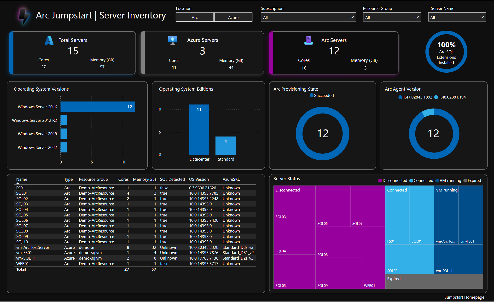
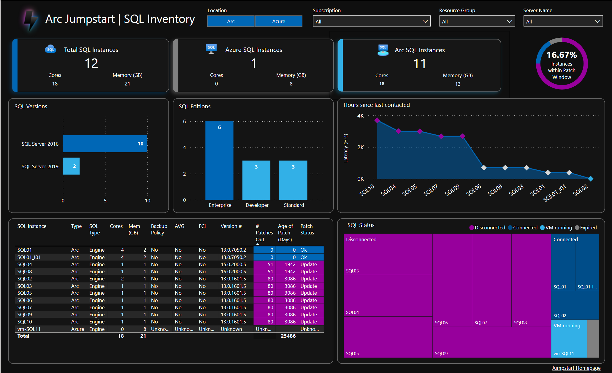
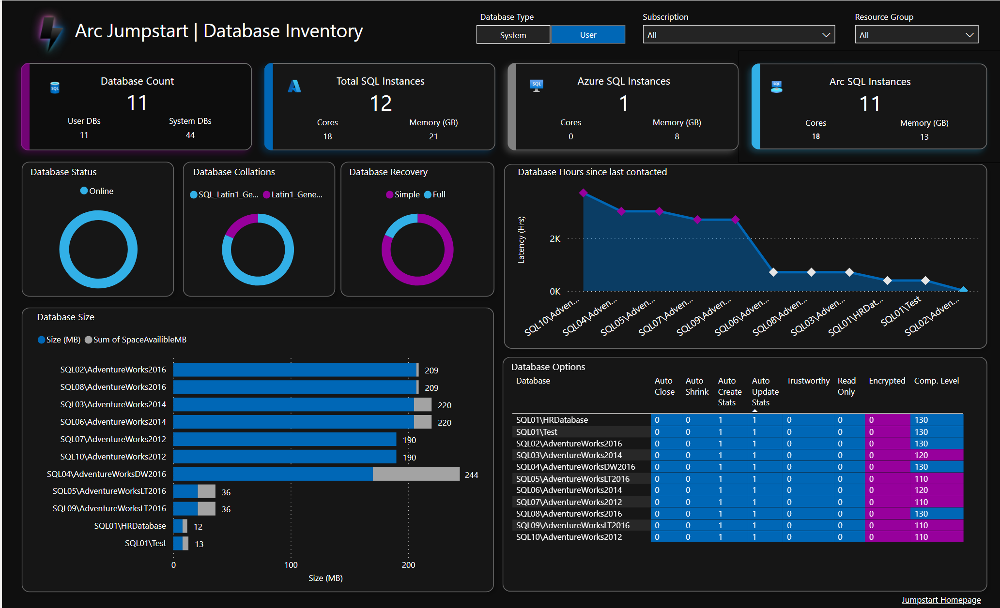
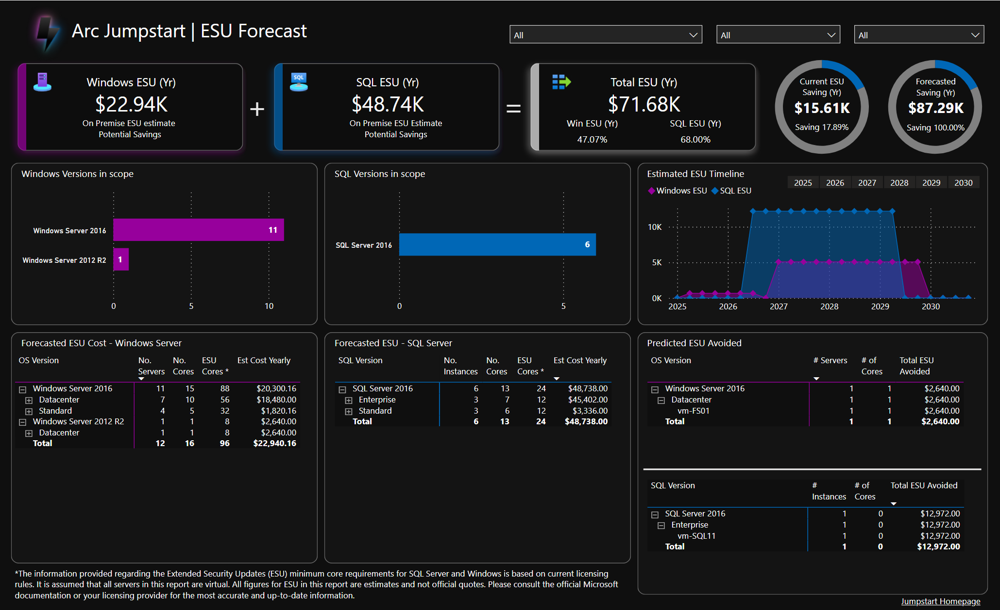
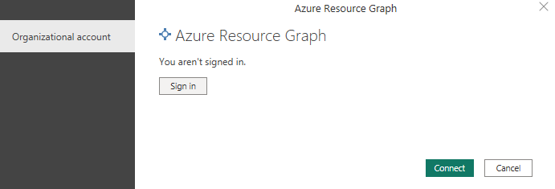

## Arc Insights PBI Dashboards Powered by Jumpstart

This is a Jumpstart PowerBI dashboard used to demonstrate the insights available via Arc and Azure Resource Graph for your IT infrastructure. The dashboard covers a wide range of scenarios for servers connected to Arc or in Azure native, including Server Invenotry, SQL Instances on Virtual Machines, SQL Databases on Virtual Machines and Extended Security Update cost forecasting. 

The Arc Insights PBI Dashboards use the PowerBI connector for Azure Resource Graph, to connect the Dashboards to your Azure Subscription(s), and thus your IT infrastructure either in Azure or COnnected to Azure via Arc. PowerBI Desktop provides a useful alternative to Azure Dashboards, as your IT Inventory and insights can be shared aross the business, without the need for users to be granted direct Portal access. In Additon, PowerBI provides more advanced query language and options for working with multiple datasets, that can be beautifully presented, as demonstrated by the ESU Forecasting dashboard. The ESU Forecasting dashboard uses a range of data sources in addition to data provided by Azure Resource Graph to provide an estimated future cost or risk of extended support, should your 2016 Arc connected Servers are not modernised before the mainstream end dates.

The Arc Insights PBI Dashboards contain:

* **Server Inventory** - A detailed inventory of all servers, both Azure and Azure Arc-connected, providing a clear overview of server landscape
* **SQL Inventory** - Information on SQL instances, including both Azure SQL and Azure Arc-enabled SQL servers, ensuring you have a complete view of your SQL VM environment
* **Databases** - Insights into databases managed through Azure Arc, helping you track and manage your database assets effectively.
* **ESU Forecast** - An estimate of future costs for Extended Security Updates (ESUs) for Windows Server 2016 and SQL Server 2016, based on current pricing. For detailed prices of ESUs see: [Azure Arc pricing](https://azure.microsoft.com/pricing/details/azure-arc/core-control-plane/)

## Screenshots

Here are some screenshots of the Arc Insights PBI Dashboards:

  
  

  
  

## Prerequisites

* Azure Subscription(s)
* Azure Arc-enabled servers within your Azure subscription(s)
* If you have SQL server VMs that are Arc-enabled, these will require the SQL Server Extension to be enabled
* Azure Credential with read access to Azure Resource Graph, to the Azure Subscription. To learn more about this see: [Permissions in Azure Resource Graph](https://learn.microsoft.com/azure/governance/resource-graph/overview#permissions-in-azure-resource-graph)
* Internet Connection
* PowerBI Desktop. You can download this at: [Download PowerBI Desktop](https://www.microsoft.com/power-platform/products/power-bi/downloads?msockid=0c5db1779a21637012a6a5f29bea62ee)

## Getting Started

### How to install the Arc Insights PBI Dashboards

1. Download the PowerBI Template file: <a href="/arc_insights_dashboard_jumpstart.pbit">Arc Insights PBI Dashboard</a>
2. Open PowerBI Template File, upon first opening the Dasboard will attempt refresh
3. During the refresh, PowerBI will prompt for credentials for "Azure Resource Graph" as shown below:

5. Sign in with a login that has "Read" access to Azure Resource Graph for the subscription(s) you want the report to view
6. Click "Connect" each time you are prompted
7. Save your new PBI Dashboard

### Data Sources Used
The Dashboard has the following data sources:
1. Azure Resource Graph - Used to gather Servers, SQL Server VM Instances and SQL VM Databases across Azure and Connected to Azure Arc. Kusto Queries (KQL) are saved to: <a href="/artifacts/arg_queries/">Azure Resource Graph Queries</a>
2. [Learn.microsoft.com](Learn.microsoft.com) - Used to gather latest SQL Patch information
3. Reference CSVs - CSVs containing Azure SKUs and Product Lifecycle dates: <a href="/artifacts/reference/">Reference CSVs</a>

## Resources

For more information please review the following resources:

* [Azure Resource Graph](https://learn.microsoft.com/azure/governance/resource-graph/overview#permissions-in-azure-resource-graph)
* [Arc-Connected Servers](https://learn.microsoft.com/azure/azure-arc/servers/overview)
* [PowerBI Connector](https://learn.microsoft.com/azure/governance/resource-graph/power-bi-connector-quickstart?tabs=power-bi-desktop#connect-azure-resource-graph-with-power-bi-connector)

## Known Issues
1. If there are no Arc or Azure resources (Servers, SQL Instances, SQL Databases) in your subscription, or the SQL server extension is missing, the Report may encounter errors