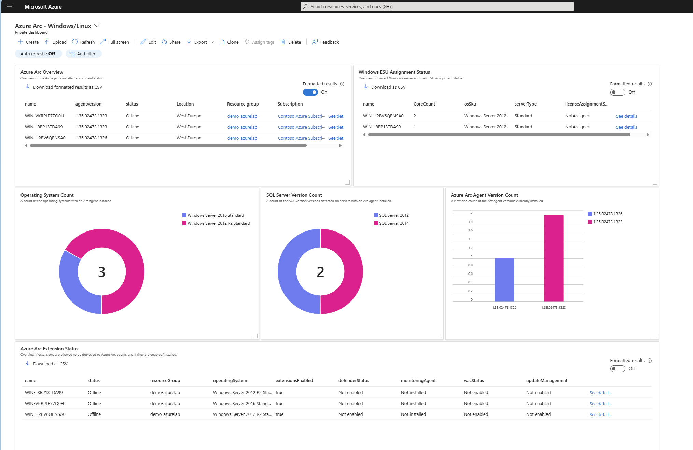
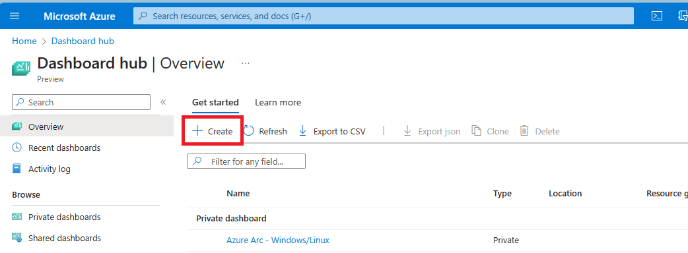
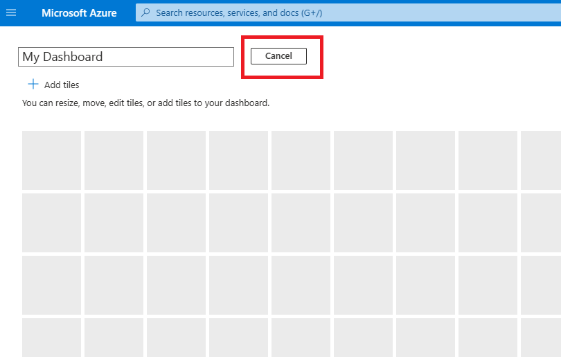
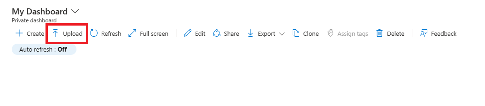

## Azure Arc Windows ESU Dashboard

This dashboard has been created to enable you to view several elements of the Windows or Linux servers you have deployed the Azure Arc agent to in one simple view. Within this dashboard you will be able to see:

* The Windows/Linux servers that have the Arc agent installed
* A count of what operating systems are being used by these Arc enabled servers
* A view of what Arc agent version is installed
* A count of any SQL instances that have been detected on the servers with Arc agents installed
* Current Windows Extended Security Updates (ESU) assignment status
* An overview of whether the Azure Arc is allowed to enable [extensions](https://learn.microsoft.com/azure/azure-arc/servers/manage-vm-extensions) or not.  And the status of some of the extensions if they are allowed to be used.



## Contributors

This Jumpstart Drop was originally written by the following contributors:

* [Sarah Lean | Senior Technical Specialist at Microsoft](www.linkedin.com/in/sazlean)

## Prerequisites

* Azure Subscription
* Azure Arc-enabled servers reporting to your Azure subscription
* Download this drop to get the necessary Dashboard template file

## Getting Started

### Import the Azure Monitor Workbook using Azure CLI

To import the workbook navigate to the directory where you have downloaded this drop to. You should be signed into your Azure environment using the [az login](https://learn.microsoft.com/cli/azure/reference-index?view=azure-cli-latest#az-login) command. And ensure you are interacting with the correct subscription you wish to deploy the Azure dashboard into.

You can then run the following commands to import the Azure Arc Windows Extended Security Updates (ESU) Dashboard.

```bash
# Variables
resourcegroup=<Provide your resource group name>
location=<Provide your location>

# Create a new dashboard that is empty
az portal dashboard create --location $location --name "AzureArcESUDashboard" --resource-group $resourcegroup --input-path ".\basic_dashboard.json"

#Populate the dashboard with the configuration
az portal dashboard import --name "AzureArcESUDashboard" --resource-group $resourcegroup --input-path ".\azure_windows_esu_dashboard.json"
```

### Import the Azure Monitor Workbook using the Azure Portal

1. Log in to [Azure Portal](https://portal.azure.com/)
2. Click on **Dashboard** from the Azure Portal menu. You may already see the dashboard view by default.

3. Click on **Create**

4. Select **Custom** Dashboard

5. You will be prompted to customise the new dashboard, click on **cancel**

6. Now select **Upload** and upload the [azure-windows_esu_dashboard.json](azure-windows_esu_dashboard.json) file


## Resources

For more information please review the following resources:

* [Azure Resource Group](https://learn.microsoft.com/azure/governance/resource-graph/overview)
* [Azure Dashboard Structure](https://learn.microsoft.com/azure/azure-portal/azure-portal-dashboards-structure)
* [Azure CLI](https://learn.microsoft.com/cli/azure/what-is-azure-cli)
